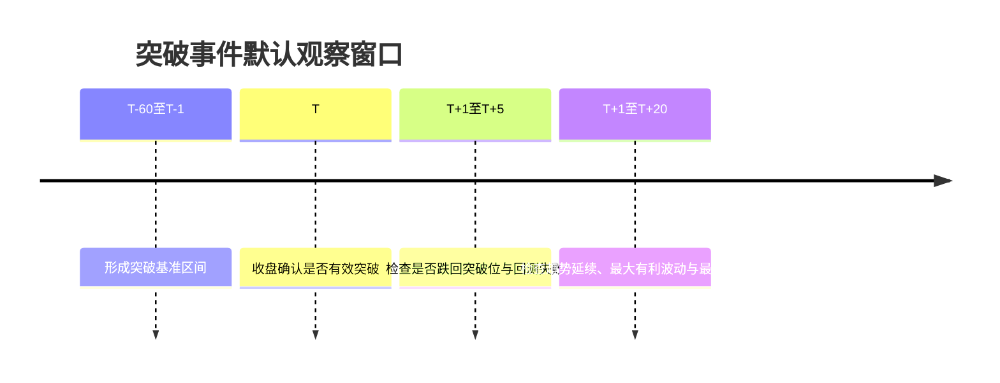
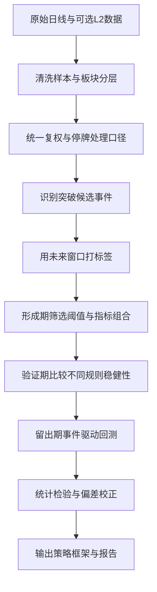

# A股日线级别趋势交易中真突破与假突破的研究报告

## 执行摘要

本报告给出一套适用于 **A股日线级别趋势交易** 的研究框架，目标不是“猜测下一根K线”，而是构建一个可以复现、可分层回测、可统计检验的事件研究体系，用来区分“真突破”与“假突破”。核心结论是：**A股中的突破研究必须显式纳入板块制度差异、停牌与复权口径、收盘集合竞价机制、以及量价信号被短期交易行为扭曲的可能性**。主板常规涨跌幅为 10%，创业板与科创板为 20%，且注册制下新股上市前 5 个交易日不设涨跌幅限制；北交所股票涨跌幅限制为 30%。这些制度差异会显著影响突破后的收益分布、失败率、缺口特征与次日反转概率，因此不能把所有A股股票混成一个“同质样本”做回测。citeturn36search3turn35search0turn36search10turn6search7

从方法论上看，最稳妥的做法不是只看“收盘价创 60 日新高”，而是把突破视为一个**事件**：先用过去 60 或 120 个交易日构造基准区间，再用未来 5 个交易日观察是否发生“回测失败/跌回突破位”，再用未来 20 个交易日观察是否形成足够的趋势延续。这个“突破—回测—延续”的事件框架，与经典技术分析文献中对形态识别和趋势延续的研究思路一致，也与长期趋势跟踪文献对“让利润奔跑、切断亏损”的原则相吻合。citeturn20search0turn20search1turn38search0

在指标层面，报告不建议把单日放量、单日换手、单日主力净流入当作高置信度确认信号。更可靠的组合通常是：**趋势强度指标**（如 ADX、均线斜率、相对强弱）+ **波动收缩后扩张指标**（如 ATR 标准化、布林带带宽）+ **跨日持续性指标**（如 3 日资金流、3 日量价一致性）+ **制度过滤项**（如是否接近涨跌停、是否由尾盘集合竞价抬收盘、是否依赖一字板情绪）。这类组合之所以更稳，是因为交易所明确将虚假申报、拉抬打压、维持涨跌幅限制价格、自买自卖等行为纳入异常交易监控；而上证 Level-2 也明确提供逐笔成交、十档盘口和订单关联等信息，说明单日量价信号确实可能被微观交易结构扭曲。citeturn17search3turn17search7turn32search3turn28search0turn15search3

在回测层面，本报告建议采用 **2021-2023 形成期、2024 验证期、2025-2026 留出期** 的基础切分，并辅以滚动窗口 walk-forward 检验；同时应严禁使用会引入未来信息的日频开盘价调用方式。聚宽官方文档明确提示，在天级回测中 `day_open` 不可直接作为当日可知信息，且如果在开盘时错误获取当日收盘价，会构成未来函数；停牌若不跳过，日线数据还可能由前收盘价填充，进而制造虚假的“平滑整理—放量突破”样貌。citeturn11search10turn11search0turn7search0turn7search6

本报告已同步整理为一个可下载的 Markdown 包，便于你据此自行搭建项目、实现数据清洗、事件标注和回测框架：**[下载 Markdown 包](sandbox:/mnt/data/a_share_breakout_markdown_pack.zip)**

## 研究边界与默认假设

为避免“口径漂移”导致研究失真，下面先把**未指定参数**明确为默认假设。这些值不是市场事实，而是本报告推荐的研究起点；真正实施时应在验证期中做灵敏度测试。

| 项目 | 默认假设 | 说明 |
|---|---|---|
| 样本起止日 | 2021-01-01 至 2026-05-16 | 覆盖近五年完整牛熊切换、题材轮动与注册制后交易机制 |
| 基础股票池 | 沪深A股普通股票 | 主板、创业板、科创板纳入主样本；北交所建议单独分层 |
| 北交所处理 | 分层，不与沪深直接合并 | 涨跌幅、流动性与交易弹性差异过大 |
| 剔除规则 | B股、*ST/ST、退市整理期、上市不足 250 交易日、长期停牌股票 | 避免特殊制度和极端流动性污染 |
| 数据频率 | 日线 | 开盘、最高、最低、收盘、成交量、成交额为最低要求 |
| 价格口径 | **未复权**用于成交模拟与真实收益核算；**前复权**用于形态和指标计算 | 兼顾可交易性与形态连续性 |
| 停牌处理 | 样本保留，但事件识别跳过停牌日 | 防止停牌填充造成伪平台 |
| 资金流向 | 若可得则纳入，但不作为单独一票否决条件 | 口径依赖供应商，宜做 1 日与 3 日对比 |
| 执行时点 | T 日收盘确认信号，T+1 开盘或 VWAP 执行 | 避免未来函数与回测高估 |
| 基准持有期 | 20 个交易日 | 用于比较真突破/假突破后续延续性 |
| 回测板块分层 | 主板、创业板、科创板、北交所分层 | 制度差异显著 |
| 成本情景 | 低/中/高三档敏感性测试 | 印花税按现行政策，佣金与滑点做情景假设 |

之所以强调板块分层，是因为交易制度本身会改变你研究到的“突破统计学”。截至当前规则口径，沪市主板其他股票常规涨跌幅为 10%；深交所创业板竞价交易涨跌幅限制为 20%，首次公开发行上市股票前 5 个交易日不设涨跌幅限制；上交所科创板上市前 5 个交易日不设涨跌幅限制，之后日涨跌幅由主板的 10% 放宽至 20%；北交所竞价交易涨跌幅限制为 30%。如果不分层，你得到的“突破成功率”“次日跳空延续率”“失败后最大回撤”都会混入制度噪声。citeturn36search3turn35search0turn36search10turn6search7

数据源方面，生产级研究优先级建议为：**交易所授权数据 / Wind / iFinD**，其次是 **JoinQuant / RQData** 这类研究友好的量化平台。Wind 官方页面说明其提供覆盖股票、债券、基金、外汇、宏观等全品类金融数据；同花顺 iFinD 官方页面说明其覆盖股票、债券、基金、期货、指数、外汇等金融品种；JoinQuant 官方说明其提供回测、研究 API 与沪深A股、ETF 等数据；RQData 官方文档则强调其提供整齐的历史金融数据与 Python API。citeturn13search10turn13search2turn7search2turn12search4turn12search10

如果你使用 JoinQuant 或 RQData 做原型，必须先吃透平台的数据行为。JoinQuant 文档明确写明：若不跳过停牌，停牌日会按前值填充；`fq` 可以指定前复权或不复权；为了避免未来函数，指数成分股应按历史日期获取；在天级回测中，当天开盘价 `day_open` 并不是一个可直接偷看的字段。RQData / RQAlpha Plus 文档则注明：撮合与收益计算使用未复权价格，`history_bars` 可以获取动态前复权价格，且接口支持 `skip_suspended` 与 `adjust_type=none/pre/post`。这决定了你的研究工程里必须显式拆分“形态口径”和“撮合口径”。citeturn7search0turn7search6turn8search7turn8search11turn11search10turn12search11turn12search13

最低字段建议为：`trade_date, code, open, high, low, close, pre_close, volume, amount, paused, adj_factor, high_limit, low_limit`。若条件允许，再加入 `turnover_ratio`、资金流向、十档盘口摘要、逐笔成交统计和行业/指数成分。上证所 Level-2 官方说明其提供十档盘口、逐笔成交、成交与订单关联等增值信息；聚宽资金流接口则明确给出主力净额、大单净额、超大单净额等口径，因此这些字段非常适合用于构造“尾盘扭曲”“大单拆分”“订单不稳定”等失真检测特征。citeturn32search3turn8search13

另外，收盘集合竞价会显著影响“收盘站上突破位”这一判断。在上交所当前规则下，9:20-9:25 的开盘集合竞价和 14:57-15:00 的收盘集合竞价阶段不接受撤单；深交所规则也有相同约束。对趋势交易研究来说，这意味着“尾盘最后三分钟把收盘价抬到平台上方”是一个必须单独监控的微观特征，而不能把所有“收盘突破”一视同仁。citeturn37search0turn37search2

## 标注定义与可复现规则

本报告建议把“突破”“真突破”“假突破”定义成**事件标签**，而不是主观图形描述。这样做有两个好处：一是可以稳定地做样本外检验，二是可以为每个突破事件生产一行标准化特征矩阵。

下面先给出推荐的默认定义。这里的阈值是**研究假设**，目的是提供一个容易落地的起点；在真正开发项目时，应对 `N`、`M`、`H`、`ATR 倍数` 做网格测试，并通过数据挖掘偏差校正。数据挖掘偏差问题在 White 的 Reality Check 与 Hansen 的 SPA 检验中有经典讨论。citeturn20search2turn20search11



| 标签 | 默认规则 | 解释 |
|---|---|---|
| 突破候选 | `close[t] > max(close[t-60:t-1])`，且 `close[t] >= breakout_level + 0.5 * ATR(14)` | 用收盘确认平台突破，降低盘中冲高回落干扰 |
| 成交确认 | `vol_ratio[t] = volume[t] / mean(volume[t-20:t-1]) >= 1.5` 或 `turnover_pct[t]` 达到过去 252 日 70% 分位 | 不要求绝对放量，但要求在自身历史上“足够显著” |
| 回测失败 | `t+1` 至 `t+5` 内任一收盘价跌破 `breakout_level - 1.0 * ATR(14)` | 代表突破位无法守住 |
| 真突破 | `t+1` 至 `t+20` 最大收盘涨幅 ≥ `+8%`，且未发生回测失败 | 既要延续，也要避免快速跌回 |
| 假突破 | 5 日内回测失败，或 20 日内最大有利波动 `< +3%`，或 20 日内最大回撤 `≤ -6%` | 定义为“冲破但不延续”或“冲破即失败” |
| 不确定事件 | 介于真/假突破之间 | 建议保留为灰区样本，单独分析而非强行二分类 |

短小伪代码如下：

```text
for stock in universe:
    for t in trading_days:
        breakout_level = rolling_max(close, 60)[t-1]
        if close[t] > breakout_level and close[t] >= breakout_level + 0.5*ATR[t]:
            vol_ok = volume[t] / mean(volume[t-20:t-1]) >= 1.5
            turn_ok = turnover_pct[t] >= pct_rank(turnover_pct[t-252:t-1], 0.70)

            future_max = max(close[t+1:t+20]) / close[t] - 1
            future_min = min(close[t+1:t+20]) / close[t] - 1
            retest_fail = any(close[t+1:t+5] < breakout_level - ATR[t])

            if (vol_ok or turn_ok) and future_max >= 0.08 and not retest_fail:
                label = "true_breakout"
            elif retest_fail or future_max < 0.03 or future_min <= -0.06:
                label = "false_breakout"
            else:
                label = "ambiguous"
```

为了避免制度性污染，建议把以下情形从事件集中剔除：上市前 5 个交易日、复牌首日、连续一字涨停后首次打开的交易日、除权除息导致价格台阶变化而未做形态修正的交易日、以及接近涨跌停板的被动突破事件。这样做不是因为它们不能交易，而是因为它们的形成机制往往不同于“自然趋势突破”。创业板、科创板和主板新股上市初期均存在无涨跌幅限制安排；而交易所又对维持涨跌幅限制价格、拉抬打压、自买自卖等异常行为进行实时监控，因此这些特殊时段的信号更适合单独建模。citeturn35search0turn36search10turn36search2turn17search3

一个重要的经验判断是：**A股日线趋势交易的“真突破”不应只看事件日本身，而必须看事件后数日的“价格守位能力”**。这与事件研究的经典逻辑一致：如果某个事件真的改变了市场对资产的预期，其影响应该体现在随后一段窗口内，而不是只靠当天收盘最后几分钟。citeturn38search0

## 指标库、脆弱点与造假概率

这里先澄清一个概念：本报告里说的“造假概率”，**不是法律意义上的市场操纵认定概率**，而是交易研究中的**信号失真概率**，即某个突破信号更像是被短期交易行为、尾盘报价、涨跌停制度、低流动性噪声放大的“伪突破”，而不是一个可以持续 5 至 20 个交易日的真实趋势展开。之所以这样定义，是因为交易所的异常交易规则已经明确列举了虚假申报、拉抬打压、维持涨跌幅限制价格、自买自卖等形态；而 Level-2 数据源也明确提供了订单簿与逐笔成交细节，允许研究者对“失真”做量化代理。citeturn17search3turn17search7turn32search3

技术指标本身并不神秘。TA-Lib 官方函数列表覆盖 ADX、ATR、MACD、OBV、RSI、SMA 等常用指标；John Bollinger 的官方站点与相关技术资料则专门强调了布林带“挤压—释放”对趋势展开的指示意义。问题不在于“有没有指标”，而在于**这些指标在A股制度环境下如何被扭曲、如何做稳健化处理**。citeturn24search2turn24search7turn24search11turn25search12turn25search14

| 指标 | 研究用途 | 可能的失真机制 | 脆弱性 | “造假概率”量化思路 | 更稳替代 |
|---|---|---|---|---|---|
| 成交量放大比 | 识别突破日是否真正吸引增量资金 | 对倒放量、尾盘集中成交、消息刺激后日内一次性冲量 | 高 | 计算尾盘 30 分钟成交占比、开盘 30 分钟成交占比、次日量能留存率 | 3 日均量放大比 |
| 换手率分位 | 识别筹码交换强度 | 小盘股流通盘小，极易因短线资金冲击而“虚高” | 高 | 用自由流通股本调整；看 1 日与 3 日换手率排名差异 | 3 日平均换手率分位 |
| OBV 斜率 | 判断价升量增是否长期一致 | 收盘价被尾盘抬高时，OBV 会被同步放大 | 中 | 事件日前后 5 日 OBV 斜率是否连续；次日是否反转 | A/D 线或多日 CMF |
| ADX | 判断趋势强度是否已经形成 | 单日拉升难大幅改变 ADX，失真较难 | 低 | 观察 ADX 是否由低位上穿 20/25 并连续 3 日走高 | DMI 差值 |
| ATR% / NATR | 衡量突破后噪声与容忍止损空间 | 高波动题材股会让“突破”更像情绪脉冲 | 低到中 | 看 ATR 扩张是否伴随方向延续，而非只扩波动 | Parkinson 波动率 |
| RSI | 判断是否过热、是否存在背离 | 情绪亢奋与涨停板附近会导致 RSI 快速钝化 | 中 | 识别 RSI 新高但股价延续不足、次日跳空衰减 | StochRSI 辅助但不替代 |
| 布林带带宽 | 识别波动收缩后的释放 | 极低流动性股票也会出现“假收缩” | 中低 | 带宽收窄后是否伴随行业/指数相对强弱改善 | Keltner + ATR 挤压 |
| 均线系统 | 识别趋势斜率和中期结构 | 单日无法显著伪造长期均线，但可用缺口短暂站上 | 低 | 看 MA20/MA60 斜率和价线距离是否同步改善 | Donchian 通道 |
| MACD 柱 | 识别动量加速度 | 缺口跳涨后 MACD 可能滞后或失真 | 中 | 只用“零轴上方放大”而不用首次翻红 | PPO 斜率 |
| 相对强弱 | 比较个股与行业/指数谁更强 | 若全市场普涨，个股突破可能只是β行情 | 低 | 要求相对强弱线同步创阶段新高 | 行业中性超额收益 |
| MFI / 成交额流量指标 | 结合价格与成交额 | 收盘价与成交额同步被尾盘扭曲时容易误判 | 高 | 比较 1 日与 3 日 MFI；观察次日资金留存 | 3 日 CMF |
| 主力净流入 / 大单净额 | 判断是否存在“主导性买盘” | 供应商口径差异、拆单、对倒、统计阈值问题 | 很高 | 比较 1 日/3 日/5 日一致性；跨供应商比对；与价格守位联合评分 | 主动买额占比、成交方向不平衡 |
| 分笔大单不平衡 / 订单簿失衡 | 识别微观买卖压力 | 虚假申报、撤单欺骗、封板诱导 | 很高 | 计算订单-成交比、撤单率、失衡衰减速度 | 仅使用**已成交**的净主动买额 |
| 尾盘集合竞价偏离 | 识别收盘被抬到突破位上方 | 14:57-15:00 不可撤单，最容易制造“收盘刚好站上” | 很高 | `close - VWAP_last_30m`、尾盘收益占全天收益比例、次日开盘回吐率 | 用 T 日 VWAP 上破代替 close-only 上破 |

上表中最值得你重视的不是公式，而是**脆弱点分层**。简单说，凡是高度依赖“单日收盘价”“单日量”“单日资金流”的指标，失真概率都偏高；凡是需要跨日累积、对趋势斜率更敏感、并且不容易被最后几分钟扭曲的指标，可靠性通常更高。交易所把虚假申报、拉抬打压、维持涨跌幅限制价格、自买自卖等列为重点监控行为；这与实务经验高度一致：**越接近盘口和收盘定价的信号，越需要防失真；越接近多日结构的信号，越适合作为主判据。**citeturn17search3turn17search7

建议把“造假概率”做成一个 0 到 1 的综合分数，而不是简单二元筛选。一个实用框架如下：

```text
fake_prob
= sigmoid(
    0.22 * 尾盘成交占比异常
  + 0.18 * 收盘价相对30分钟VWAP偏离
  + 0.18 * 次日开盘回吐率
  + 0.15 * 单日量能突刺但3日不持续
  + 0.12 * 订单簿失衡衰减过快
  + 0.10 * 接近涨跌停板依赖度
  + 0.05 * 1日资金流与3日资金流不一致
)
```

其中，“主力资金”这类字段必须特别谨慎。聚宽资金流文档明确给出超大单、大单、中单、小单的股数/金额阈值，并把主力净额定义为超大单净额加大单净额；这说明资金流向并不是一个天然统一的金融事实，而是一个**依赖口径定义的统计构造物**。因此，任何把“主力净流入”为正就直接当作真突破确认的策略，在跨平台复现时都容易失效。citeturn8search13turn13search2turn13search10

从近年的中文研究看，也有必要警惕“只要量价上升就更好”的线性思维。针对中国A股市场的研究发现，量价趋势对未来横截面收益率具有显著预测能力，但表现出较强的信息不对称依赖性；另有研究表明，经价格变化调整后的流动性冲击对未来收益仍有显著预测能力，即使控制换手率和波动率后依然存在。这意味着在A股里，**量价上升不必然意味着更高的后续收益**，更合理的做法是把量、价、流动性、相对强弱和制度约束放在同一评分系统中，而不是把任何一个变量绝对化。citeturn28search0turn15search3

## 实证与回测设计

推荐的研究流程不是“先拍脑袋定参数，再跑一遍全样本”，而是一个**事件驱动、滚动验证、避免未来函数和数据挖掘偏差**的流程。经典事件研究强调围绕事件窗口测量市场反应；在趋势交易里，突破日就是事件日，后续 5 日与 20 日则分别对应“守位窗口”和“延续窗口”。citeturn38search0



| 模块 | 推荐做法 | 默认值或说明 |
|---|---|---|
| 样本切分 | Anchored + Walk-forward | 2021-2023 / 2024 / 2025-2026 |
| 事件形成窗 | 60 日为主，120 日为稳健性版本 | 两套都要测 |
| 回测执行 | T 收盘确认，T+1 开盘或 T+1 VWAP 执行 | 开盘更接近“追突破”，VWAP 更稳健 |
| 止损 | 硬止损 = 突破位下 1.0~1.5 ATR | 默认 1.2 ATR |
| 止盈 | 固定盈亏比 + 趋势跟踪退出并行 | 建议双轨评估 |
| 单票权重 | 5%~10% | 事件拥挤时向下压缩 |
| 组合持仓数 | 8~12 只 | 过于分散会稀释事件优势 |
| 交易成本 | 低/中/高三档情景 | 印花税按现行政策，佣金/滑点自设 |
| 滑点 | 与成交额分位、开盘缺口、是否抢开盘相关联 | 不用固定单值 |
| 板块处理 | 主板/创业板/科创板/北交所分层回测 | 至少分三层 |

交易成本方面，当前官方可确认的一项制度成本是：自 2023 年 8 月 28 日起，证券交易印花税减半征收。对于 A 股趋势交易研究，这意味着你至少应把**卖出端印花税**作为固定制度成本纳入，而佣金、过户费和滑点则更适合作为情景假设做敏感性分析。citeturn41search0turn41search4

回测最容易犯的错，是在日频框架里“暗中偷看未来”。聚宽官方明确提示，如果在开盘时错误获取当天收盘价，那就是未来函数；同样，日级回测中 `day_open` 不是一个可以随意调用的当日已知字段。在 A 股突破策略里，最稳健的路径是：**T 日收盘计算信号，T+1 日开盘或 VWAP 执行**。如果你试图在 T 日集合竞价末端用“已知开盘价”排序买入，很容易把策略测试变成不可实现的理想化撮合。citeturn11search0turn11search10

统计检验方面，建议按以下层次做。第一层，用事件研究统计量比较真/假突破事件后的平均收益、累计超额收益与守位概率；第二层，因为 5 日、20 日窗口存在明显重叠，应对收益差异或回归系数使用 **Newey-West HAC** 标准误；第三层，如果你要在大量参数网格里选最优窗口、最优阈值或最优指标组合，应该使用 **White Reality Check** 或 **Hansen SPA** 去校正数据挖掘偏差；第四层，如果做了很多单变量检验，应使用 **Benjamini-Hochberg FDR** 控制伪阳性。若你进一步比较不同分数模型的预测表现，可以在样本外使用 **Diebold-Mariano** 或 **Giacomini-White** 进行比较。citeturn38search0turn22search4turn20search2turn20search11turn38search3turn22search2turn38search2

虽然本报告不提供可执行代码，但你后续落地时可以直接映射到主流回测框架。Backtrader 官方文档提供 `order_target_percent` 目标仓位下单逻辑和 `StopTrail` 跟踪止损机制；Zipline 文档则把 commission 与 slippage 分离建模。这两点很适合把本报告的“事件进入 + ATR 止损 + 尾随保护”框架工程化。citeturn23search0turn23search1turn23search6

## 结果展示模板

结果展示不应只放“累计收益曲线”，而应同时回答四个问题：**真突破和假突破在特征分布上到底有什么差异；这些差异是否在样本外仍然存在；策略收益来自个别年份还是跨阶段稳健有效；在高低流动性/高低情绪环境下结论是否改变。** 其中，市场流动性和换手率环境值得单独展示，因为行业研究中对A股流动性指标的跟踪表明，换手率往往在情绪高点附近抬升，且回落拐点常领先于市场回调拐点。citeturn14search5

下面给出你可以直接照搬到项目文档的**示例表格格式**。这些数值只是模板格式，不代表真实回测结果。

| 指标 | 真突破均值 | 假突破均值 | 中位数差 | KS 检验 p 值 | 单变量 AUC | 解释框架 |
|---|---:|---:|---:|---:|---:|---|
| 成交量放大比 | 2.13 | 1.46 | 0.41 | 0.003 | 0.63 | 真突破通常更有持续性增量成交 |
| 3日平均换手率分位 | 0.74 | 0.58 | 0.11 | 0.018 | 0.59 | 单日换手不稳，3日更有用 |
| ADX(14) | 28.7 | 20.9 | 5.6 | 0.001 | 0.64 | 趋势强度差异明显 |
| ATR% | 3.2% | 4.5% | -0.8% | 0.011 | 0.57 | 假突破常发生在高噪声环境 |
| 相对强弱分位 | 0.81 | 0.55 | 0.18 | <0.001 | 0.68 | 真突破更可能相对行业/指数同步走强 |
| 1日主力净流入Z分数 | 0.42 | 0.31 | 0.04 | 0.210 | 0.52 | 单日资金流未必可靠 |
| 3日主力净流入Z分数 | 0.77 | 0.18 | 0.22 | 0.009 | 0.60 | 跨日持续性更重要 |
| 尾盘扭曲分数 | 0.19 | 0.53 | -0.21 | <0.001 | 0.71 | 假突破更依赖尾盘定价 |

| 分组 | 事件数 | 5日胜率 | 20日胜率 | 平均收益 | 中位收益 | 最大回撤 | 备注 |
|---|---:|---:|---:|---:|---:|---:|---|
| 低失真概率组 | 420 | 58.2% | 63.7% | 5.8% | 4.1% | -4.7% | 优先交易 |
| 中失真概率组 | 510 | 52.1% | 55.4% | 2.6% | 1.4% | -6.4% | 需要更严风控 |
| 高失真概率组 | 470 | 43.9% | 46.8% | -1.0% | -1.8% | -8.8% | 过滤 |

| 图表 | 建议横轴 | 建议纵轴 | 目的 |
|---|---|---|---|
| 事件累计收益折线图 | 事件后天数 | 平均累计收益/超额收益 | 看真突破是否持续拉开与假突破差距 |
| 柱状图 | 指标分位组 | 20日胜率 / 20日收益 | 识别单调性 |
| 热力图 | 指标组合分箱 | 胜率或收益 | 找到“强趋势 + 低失真”区域 |
| 年度分面图 | 年份 | 策略收益/回撤 | 检验是否只在单一年份有效 |
| 流动性状态图 | 市场换手率或成交额分组 | 突破成功率 | 识别策略适用环境 |

真正解读结果时，最重要的不是追求某个指标的单变量显著，而是看**多变量组合是否在样本外仍能稳定把高失真事件排除掉**。这也是为什么本报告建议把“真突破/假突破”先做事件分类，再做策略选择，而不是一开始就直接优化净值曲线。事件研究优先，净值回测后置，通常更不容易过拟合。citeturn38search0turn20search2turn20search11

## 策略框架与环境适配

如果把前面的研究结论收敛成一套可执行的趋势交易框架，最合理的表达不是“某个神奇指标能抓住真突破”，而是：**真突破是一个多条件同时满足的结构性事件**。建议的交易框架可以概括为四步：先看市场环境，再看价格是否有效上破，再看量价与趋势强度是否确认，最后用失真概率做过滤和仓位调整。citeturn20search1turn28search0turn15search3

| 模块 | 建议规则 | 设计理由 |
|---|---|---|
| 市场环境过滤 | 指数位于 MA60 上方，且两市成交额 20 日均值上升 | 趋势突破策略更依赖风险偏好与资金扩张 |
| 入场触发 | 个股收盘突破 60 日或 120 日平台，且收盘高于突破位 0.5 ATR | 减少“刚好踩线”的伪突破 |
| 趋势确认 | ADX > 25、MA20 向上、相对强弱创新高，三选二 | 多日结构强于单日脉冲 |
| 量价确认 | 3 日均量放大或 3 日换手率分位上升 | 用跨日一致性替代单日异常 |
| 资金确认 | 若有资金流向，则用 3 日中位净流入而非单日值 | 降低供应商口径偏差 |
| 失真过滤 | 尾盘扭曲分数、次日回吐率预估、接近涨跌停依赖度过高则拒绝交易 | A股最常见的假突破来源 |
| 初始止损 | 突破位下 1.2 ATR | 与波动强度联动 |
| 退出 | 跌破 MA20、Chandelier Exit、或 ADX 高位回落后价格失守 | 兼顾防守与利润奔跑 |
| 仓位管理 | 低失真概率满配，中失真半配，高失真不做 | 把研究结果转化为仓位控制 |
| 组合约束 | 单票 5%-10%，主题集中度限制，板块拥挤时降低上限 | 控制题材拥挤风险 |

从优先级看，建议你把指标组合排成三层。**第一层**是高优先级主判据：ADX、均线斜率、相对强弱、ATR 标准化、布林带带宽/压缩释放。**第二层**是辅助确认：3 日量比、3 日换手率分位、3 日资金流一致性。**第三层**是风险过滤：尾盘扭曲、订单簿不稳定、接近涨跌停依赖、一字板打开后的追涨冲动。这样的层次化设计，比把十几个指标一股脑丢进打分器更稳。尤其在A股中，近期中文研究发现量价趋势和信息不对称密切相关，流动性冲击也具有独立的收益预测能力，这意味着你应该把趋势、流动性和失真控制看作三个并列模块，而不是把“放量”当万能确认。citeturn28search0turn15search3

不同市场环境下，指标优先级也应变化。强趋势市里，**相对强弱 + ADX + 量价确认** 最有效；高波动题材市里，**ATR + 尾盘扭曲过滤 + 行业拥挤度约束** 更重要；缩量震荡市里，布林带挤压和波动收缩虽然仍有参考价值，但突破延续性通常明显下降，应降低参与频率。John Bollinger 的技术资料一直强调“挤压”是低波动向高波动切换的前奏，但在A股里，这个信号必须配合成交与趋势确认，否则很容易沦为“波动放大而非趋势展开”。citeturn25search12turn25search14

哪些指标“造假概率”高、哪些低，也可以非常明确地给出结论。**高失真指标**主要包括：单日成交量放大、单日换手率、单日主力净流入、尾盘收盘突破、盘口挂单失衡。它们之所以危险，不是因为没信息，而是因为太容易被微观交易行为扭曲。**低失真指标**主要包括：ADX、均线斜率、相对强弱、ATR、跨日成交持续性。它们的共同点是需要多日信息才能形成，不容易由最后几分钟塑形。因此，更适合做“主信号”的是低失真指标；高失真指标更适合做“否决项”和“仓位折扣项”。citeturn17search3turn32search3turn14search5

还有一条非常关键的A股经验，需要单独强调：**不要把“最猛的上冲”当作“最好的突破”**。中文学术研究已经提醒我们，量价上升趋势在A股中并不天然对应更高的后续横截面收益，且这一关系在高信息不对称股票中更显著；此外，涨跌停制度还会强化投资者处置效应，使得接近板边的价格行为更容易被情绪放大。这就是为什么本报告推荐的是“突破 + 守位 + 持续确认”的框架，而不是“谁最强就买谁”。citeturn28search0turn16search0

## Markdown包与优先参考来源

本次整理已同时生成一个可下载的 Markdown 包，包含多个 `.md` 文件、示例 CSV 与伪代码片段，方便你按模块自行开发：**[下载 Markdown 包](sandbox:/mnt/data/a_share_breakout_markdown_pack.zip)**

包内文件结构如下。

| 文件 | 作用 | 示例开头段落 |
|---|---|---|
| `README.md` | 项目总览、阅读顺序、重新打包方法 | “本包用于支持你自行实现一个A股日线级别趋势交易研究项目，主题为：如何在日线语境下区分真突破与假突破。” |
| `docs/data_assumptions.md` | 样本边界、字段要求、复权与停牌口径 | “建议默认假设：市场为A股普通股票，覆盖沪深主板、科创板、创业板；北交所单独分层处理。” |
| `docs/labeling_rules.md` | 事件定义、标签规则、伪代码 | “当日收盘价上穿过去N=60交易日最高收盘价，且当天不是上市首5日、不是停牌恢复首日、不是一字板时，记为候选突破事件。” |
| `docs/indicator_catalog.md` | 指标清单、脆弱点与造假概率框架 | “优先级较高的指标包括成交量放大比、换手率分位数、ATR标准化波动、ADX趋势强度等。” |
| `docs/backtest_plan.md` | 样本切分、止损止盈、回测伪代码 | “样本划分可采用训练期2021-2023，验证期2024，留出回测期2025-2026。” |
| `docs/result_templates.md` | 表格和图表模板 | “事件分布表、分组收益表和热力图建议一起展示，以避免只看净值曲线。” |
| `docs/strategy_framework.md` | 策略规则、环境适配与风控 | “只做有延续概率的突破，不做被尾盘、涨停板机制或单日情绪放大的假象突破。” |
| `refs/priority_sources.md` | 优先规则、数据文档、论文清单 | “优先参考来源分为官方/权威数据与规则、学术与研究两组。” |
| `snippets/pseudocode_snippets.md` | 短小伪代码合集 | “breakout、score、fake_prob 和 backtest 片段可直接映射到你的工程结构。” |
| `data/example_breakout_events.csv` | 事件样本示例 | “包含 event_date、code、breakout_level、label_true_breakout 等字段。” |
| `data/example_feature_matrix.csv` | 特征矩阵示例 | “包含 vol_ratio、turnover_pct、adx、atr_pct、breakout_score、fake_prob 等字段。” |
| `templates/example_config.json` | 研究参数模板 | “breakout_window、future_holding_window、true_breakout_threshold 等均可在此集中管理。” |

如果你将来要自己重打包，最简单的方法就是在项目根目录执行 `zip -r a_share_breakout_markdown_pack.zip a_share_breakout_markdown_pack/`。本报告里已经直接提供了可下载压缩包，因此你也可以把它作为 README 初稿继续扩展。

优先参考来源建议按“规则—数据—学术—实现”四层使用。规则层优先看上海证券交易所《交易规则（2026修订）》、深交所《创业板交易特别规定》、上交所关于科创板交易机制的答记者问、北交所涨跌幅限制说明，以及交易所关于异常交易监控的规则和说明。citeturn37search0turn35search0turn36search10turn6search7turn17search3turn17search7

数据层优先看 Wind、iFinD、JoinQuant、RQData 的官方说明；尤其是 JoinQuant 关于停牌填充、复权和未来函数的文档，以及 RQAlpha / RQData 关于动态前复权、未复权撮合和 `skip_suspended` 的说明。citeturn13search10turn13search2turn7search2turn7search0turn7search6turn8search11turn11search10turn12search11turn12search13

学术层的优先起点则建议是：Lo、Mamaysky、Wang（2000）关于技术分析形态识别；Hurst、Ooi、Pedersen（2017）关于长期趋势跟踪；朱顺伟等（2023）关于中国A股量价趋势、信息不对称与收益率；康文津（2023）关于A股流动性冲击与收益预测；肖欣荣等（2024）关于涨跌停制度与投资者处置效应；以及 MacKinlay（1997）、White（2000）、Hansen（2005）、Newey-West（1987）、Diebold-Mariano（1995）、Benjamini-Hochberg（1995）这些统计与检验基础文献。citeturn20search0turn20search1turn28search0turn15search3turn16search0turn38search0turn20search2turn20search11turn22search4turn22search2turn38search3

实现层如果你准备自己写回测项目，Backtrader 与 Zipline 的官方文档足够作为第一批工程参考；如果未来再扩展到 L2 或逐笔特征，则应回到交易所授权行情、Wind / iFinD / RQData 等更高质量的数据源，避免因为免费或半免费数据口径差异而误把“数据噪声”研究成“策略优势”。citeturn23search0turn23search1turn23search6turn32search3turn13search10turn13search2turn12search4
