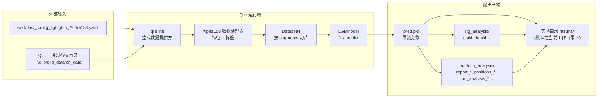

# `qrun benchmarks/LightGBM/workflow_config_lightgbm_Alpha158.yaml` 数据流说明

本文档描述在该命令下**数据从哪里来、经过哪些阶段、变成什么形态、最终写到哪里**，不展开源码实现细节。默认你在仓库中执行：

```bash
cd examples
qrun benchmarks/LightGBM/workflow_config_lightgbm_Alpha158.yaml
```

工作流配置文件路径：`examples/benchmarks/LightGBM/workflow_config_lightgbm_Alpha158.yaml`（相对仓库根目录）。

---

## 零、先从架构视角理解这条工作流

如果先不看细节，只看分层，可以把这条链路理解成 5 层：

1. 配置层  
   `yaml` 只负责声明“用什么组件、传什么参数”，本身不是执行逻辑。
2. 数据源层  
   `cn_data` 提供原始行情、交易日历、股票池、基准等底层数据。
3. 特征与数据处理层  
   `Alpha158`、`QlibDataLoader`、`DataHandlerLP` 把原始行情加工成机器学习样本。
4. 模型层  
   `DatasetH` 负责按时间切片，`LGBModel` 负责训练和预测。
5. 评估与回测层  
   `SignalRecord`、`SigAnaRecord`、`PortAnaRecord` 负责信号落盘、IC 分析和组合回测。

对应到执行顺序，就是：

```text
YAML
-> qlib.init
-> Alpha158 / QlibDataLoader
-> DataHandlerLP
-> DatasetH
-> LGBModel.fit / predict
-> SignalRecord
-> SigAnaRecord
-> PortAnaRecord
-> mlruns
```

把 `QlibDataLoader` 和 `DataHandlerLP` 放到这个 benchmark 的真实数据流里看，区别会更清楚。这里的底层数据源是 `~/.qlib/qlib_data/cn_data`。在这份二进制数据里，通常直接存的是 `$open`、`$high`、`$low`、`$close`、`$vwap`、`$volume` 这类基础行情序列，以及交易日历、股票池成分等元数据；一般并不会直接存好 `Alpha158` 因子列，更不会直接存一个叫 `LABEL0` 的训练标签列。

在这条链路里，第一步接触 `cn_data` 的其实是 `QlibDataLoader`。例如，对 `SH600000` 在某个交易日 `T` 的样本，`QlibDataLoader` 会从 `cn_data` 里读取它前后若干天的基础字段，比如 `$close`、`$high`、`$low`、`$vwap`、`$volume`，然后按表达式现场计算出需要的列。若只做一个最小例子，可以把它理解成：

```text
输入：cn_data 里的 $close 原始序列
表达式：["$close", "Ref($close, -2)/Ref($close, -1) - 1"]
输出：一张 DataFrame，其中一列是特征，一列是 LABEL0
```

也就是说，`QlibDataLoader` 解决的是“从 `cn_data` 取哪些原料，并按公式拼成什么表”的问题。放到 `Alpha158` 里，就是把一批基础行情字段变成 158 个特征列，再额外生成默认标签 `LABEL0 = Ref($close, -2)/Ref($close, -1) - 1`。

但到了模型训练阶段，只有这张原始表还不够。还需要继续回答几个问题：哪些样本只用于训练，哪些样本给推理用；标签为空的行怎么处理；标准化参数在什么时间段上拟合；训练时和预测时看到的是不是同一份处理结果。这一层就是 `DataHandlerLP` 在做的事。它内部会先调用一个 `data_loader` 拿到原始表，在这里通常就是接住 `QlibDataLoader` 的输出；然后继续按配置依次运行 `shared_processors`、`infer_processors`、`learn_processors`；最后在内存里维护三份数据：`raw`（原始数据，`self._data`）、`infer`（给预测/推理使用的数据，`self._infer`）、`learn`（给训练使用的数据，`self._learn`）。

这里的 `raw` 容易和 `cn_data` 混淆。更准确地说，`cn_data` 是底层数据仓库，里面存的是 `$close`、`$volume` 这类基础行情序列；`raw` 则是已经经过 `QlibDataLoader` 取数和表达式展开之后的原始样本表。也就是说，相对 `cn_data` 而言，`raw` 已经不是“最底层原始数据”了，因为它已经把底层字段组织成了当前任务要用的 feature/label 表；但相对 `DataHandlerLP` 的 processor 流程而言，`raw` 仍然是“未处理表”，因为它还没有经过 `shared_processors`、`infer_processors`、`learn_processors` 这三段加工。

`shared_processors` 的作用是放那些训练和推理两边都必须一致执行的公共处理步骤；`infer_processors` 只作用在推理视图上，用来生成 `self._infer`；`learn_processors` 只作用在训练视图上，用来生成 `self._learn`。因此，如果某一步处理在训练和预测时都应该一致，例如某些公共清洗或统一格式整理，可以放进 `shared_processors`；如果某一步只适合训练阶段，例如去掉标签为空的样本 `DropnaLabel`，就应该放进 `learn_processors`，而不应影响推理侧数据。以当前 `Alpha158` 配置为例，它内部默认会在 `learn_processors` 里执行 `DropnaLabel` 和对标签做 `CSZScoreNorm`；如果你额外配置了 `infer_processors`，那么给模型预测用的数据还会再经过对应的推理侧处理流程。

所以，用 `cn_data` 的实际处理路径来概括就是：`QlibDataLoader` 负责“从 `cn_data` 拿基础行情并按表达式生成因子/标签列”，`DataHandlerLP` 负责“把这些列继续加工成训练和推理真正要消费的数据视图”。而 benchmark YAML 里直接写的 `Alpha158`，本质上就是把这两步提前封装好了：它先在内部组装 `QlibDataLoader`，再继承 `DataHandlerLP` 接管后续 processor 和数据分发流程。

如果用更口语的方式理解：

- `cn_data` 是原材料仓库
- `Alpha158` 是特征加工车间
- `DatasetH` 是按时间分拣样本
- `LGBModel` 是学习“如何给股票打分”
- `SigAnaRecord` 是检查“分高的股票后来是不是更强”
- `PortAnaRecord` 是把分数真的放进策略里做模拟交易

带着这个全局图，再往下看每个阶段的输入、处理中间态和输出，会更容易对齐源码。

---

## 一、流程总览（先见森林）

| 阶段 | 做什么 | 数据上发生了什么 |
|------|--------|------------------|
| 1. 启动与初始化 | 读取 YAML、`qlib.init` | 指定**行情数据源根目录**与**实验区**（实验跟踪目录） |
| 2. 构建数据集 | `Alpha158` + `DatasetH` | 从二进制行情库**读取原始字段** → 计算 **158 维因子**与 **标签列** → 按时间切成 train/valid/test |
| 3. 训练 | `LGBModel.fit` | **训练段**（及需要时的验证段）上的 `(特征矩阵, 标签)` → **拟合好的模型**（内存 + 随后写入实验产物） |
| 4. 预测 | `model.predict` | **测试段**上的特征 → **逐日、逐股票的预测分数**（signal / score） |
| 5. 信号落盘 | `SignalRecord` | 预测分数、测试段标签等 → **写入当前 Recorder 的 artifact** |
| 6. 信号分析 | `SigAnaRecord` | 预测 vs 标签 → **IC / Rank IC 等序列与标量指标** |
| 7. 组合回测 | `PortAnaRecord` | 预测分数作为策略输入 → **调仓、成交、净值、相对基准的超额** → 风险指标与报表文件 |

---

## 二、数据流示意图



---

## 三、各阶段：输入 / 中间数据形态 / 输出（含举例）

### 阶段 1：配置与数据根目录

**输入**

- **YAML 文件**：`examples/benchmarks/LightGBM/workflow_config_lightgbm_Alpha158.yaml`
  - `qlib_init.provider_uri`：一般为 `~/.qlib/qlib_data/cn_data`（展开为用户主目录下的绝对路径）
  - `qlib_init.region`：`cn`
- **本地行情数据**：上述 `provider_uri` 目录中已准备好的 Qlib 日线二进制数据（各标的、各字段的分区文件，由官方或社区工具事先下载/转换得到）

**输出（逻辑上）**

- 进程内：**数据提供方**指向该 `provider_uri`，后续所有 `D.features`、DataLoader 读取均从这里取数。
- **实验跟踪根 URI**：若配置里未单独写 `exp_manager`，CLI 会把实验文件落在**当前工作目录**下的 `mlruns/`（`file:<cwd>/mlruns`）。

**举例**

- `provider_uri` 解析后类似：`/home/yourname/.qlib/qlib_data/cn_data`
- 若你在 `/root/qlib/examples` 下执行 `qrun`，则默认实验目录为：`/root/qlib/examples/mlruns/`

---

### 阶段 2：Alpha158 特征与标签

**输入**

- **股票池**：YAML 中 `market: csi300`，数据处理器使用 `instruments: csi300`（沪深 300 成分口径由 Qlib 数据与 `instruments` 定义共同决定）。
- **时间范围**（与配置一致）：
  - 行情与因子加载总窗口：`start_time`～`end_time`（如 2008-01-01～2020-08-01）
  - 处理器拟合窗口：`fit_start_time`～`fit_end_time`（用于部分预处理/归一化在训练期上 fit）
- **原始行情字段**：由 `Alpha158` 内部配置的 `QlibDataLoader` 从二进制库中读取（如开高低收、成交量、复权价等，具体字段集合由 Alpha158 因子定义决定）。

**中间数据（概念形态）**

- **特征表**：在 `(日期 × 股票)` 上展开，约 **158 列**因子（名称由 Alpha158 规则生成，如各类价量、均线、波动等），供 `learn` / `infer` 使用。
- **标签列**：默认 **`LABEL0`**，由收盘价表达式在加载时计算（**不是**原始 bin 里的现成字段；详见下节）。

**举例（结构说明，非真实数值）**

- 某一行可理解为：`(datetime=2014-06-03, instrument=SH600000)` 对应 `158` 个特征值 + `LABEL0`。

### 标签列 LABEL0：含义、数值例子与来源

> **公式写法**：行内公式使用 `$ … $`；独立展示的公式使用单独成段的 `$$ … $$`（上下各空一行），便于在 GitHub、VS Code 等环境中一致渲染。

**定义（Alpha158 默认）**  
`Alpha158` 在 `qlib.contrib.data.handler` 中将标签配置为：

- **表达式**：`Ref($close, -2) / Ref($close, -1) - 1`
- **列名**：`LABEL0`

官方文档（`docs/component/data.rst`）说明：该标签表示 **T+1 日收盘到 T+2 日收盘** 的相对收益，而不是「T 收盘 → T+1 收盘」。常见解释是 A 股交易习惯：**在 T 日收盘得到信号 → T+1 才能买入 → T+2 才能卖出**，因此用 **T+1→T+2** 这段收益作为监督目标，更贴近可交易窗口。

记样本在日历上对应交易日为 **T**，**T+1**、**T+2** 为紧随其后的两个交易日；$C_{T+1}$、$C_{T+2}$ 分别为 **T+1**、**T+2** 日的收盘价。则标签在数值上等价于：

$$
\mathrm{LABEL0} = \frac{C_{T+2}}{C_{T+1}} - 1
$$

与 Qlib 表达式 **`Ref($close, -2) / Ref($close, -1) - 1`** 在「以收盘价为基准、按交易日对齐」的前提下一致。

**数值例子**

- **例 1（上涨）**：$C_{T+1} = 10.00,\; C_{T+2} = 10.20$。

$$
\mathrm{LABEL0} = \frac{10.20}{10.00} - 1 = 0.02
$$

即约 **+2%**。

- **例 2（下跌）**：$C_{T+1} = 20.00,\; C_{T+2} = 19.60$。

$$
\mathrm{LABEL0} = \frac{19.60}{20.00} - 1 = -0.02
$$

即约 **-2%**。

**怎么来的**

1. **原始 Qlib 二进制数据**中通常有 **`$close`**（复权收盘价等）等基础行情序列，**一般没有**名为 `LABEL0` 的单独存储列。
2. **`QlibDataLoader`** 在 DataHandler 拉数时，通过 **Qlib 表达式引擎** 对 `$close` 计算 `Ref(...)`，**现场生成** `LABEL0`，再与特征一起进入 `DatasetH` /模型训练。
3. 若使用 **`Alpha158vwap`**，默认标签为 `Ref($vwap, -2)/Ref($vwap, -1) - 1`，列名仍为 `LABEL0`，仅价格字段从收盘价改为 VWAP。

**小结**

| 项目 | 说明 |
|------|------|
| 列名 | `LABEL0`（Alpha158 默认） |
| 与特征同日索引 T 对应的含义 | 约等于 **T+1 收盘 → T+2 收盘** 的收益率 |
| 原始 `cn_data` bin 里有没有 `LABEL0` | **通常没有**；有 **`$close`** 等基础字段，由框架 **派生** |

---

### 阶段 3：DatasetH 时间切分

**输入**

- 上一步处理器生成的统一数据视图。
- YAML 中 `task.dataset.kwargs.segments`：

```yaml
train: [2008-01-01, 2014-12-31]
valid: [2015-01-01, 2016-12-31]
test:  [2017-01-01, 2020-08-01]
```

这里的 `train / valid / test` 是 **机器学习样本切分**，用于控制哪些日期的数据进入训练、验证和样本外预测；它与 `port_analysis_config.backtest.start_time / end_time` 这类 **交易回测区间** 不是同一个概念，后者控制的是拿已经生成好的预测信号去做模拟交易的日期范围。

**输出（逻辑形态）**

- **train**：仅落在训练段日期范围内、且属于股票池的样本，用于 `LGBModel.fit` 的主要拟合。
- **valid**：验证段样本，是否参与拟合取决于 `LGBModel` 实现；LightGBM 这类模型通常会用它做 early stopping、调参与模型选择，因此它服务于训练过程控制，而不是作为最终效果汇报的主区间。
- **test**：测试段样本，**不参与训练**，主要用于生成样本外 `predict` 结果、计算 IC/Rank IC，并作为后续 `PortAnaRecord` 回测的信号输入来源；常见配置下回测区间会直接落在 `test` 段内或与之相同，若把 `backtest.start_time / end_time` 设得更短，则等于只回测 `test` 段中的一个子区间。

**举例**

- train 段某日可能包含约 300 只成分股 × 该日有效样本；test 段从 2017-01-01 起用于生成**样本外预测**。

---

### 阶段 4：模型训练与预测

**输入**

- **训练（及可能的验证）**：`DatasetH` 提供的特征张量/表与 `LABEL0`。
- **测试**：同上的特征部分（测试段）。

**输出**

- **内存中**：拟合后的 `LGBModel`（梯度提升树集成）。
- **预测**：对 **test 段**每个 `(datetime, instrument)` 输出一个**连续分数**（分数越高通常表示模型越看多该标的的相对收益）。

**举例（预测表结构）**

- `pred.pkl` 中对象多为 `pandas.DataFrame`：
  - **索引**：多级索引 `(instrument, datetime)`（层级名一般为 `instrument`、`datetime`）。
  - **列名**：常见为 `score`（或由模型输出列转换而来）。
- 示例行（虚构数值）：

| instrument | datetime   | score   |
|------------|------------|---------|
| SH600000   | 2017-01-03 | 0.0312  |
| SH600000   | 2017-01-04 | -0.0084 |
| SZ000001   | 2017-01-03 | 0.0156  |

---

### 阶段 5：SignalRecord（信号与标签落盘）

**输入**

- 训练好的 `model` 与 `dataset`（其中 dataset 仍可按需取出测试段标签）。

**输出（写入当前 Recorder）**

- **`pred.pkl`**：测试段预测分数（见上表）。
- **`label.pkl`**：与预测对齐的测试段**原始标签**（`LABEL0`），用于后续 IC 与多空分析等。

**数据流关系**

- `pred.pkl` 与 `label.pkl` 在 **test 时间范围**内按 `(instrument, datetime)` 对齐后，供 `SigAnaRecord` 计算 IC。

---

### 阶段 6：SigAnaRecord（信号质量分析）

**输入**

- `pred.pkl` 第一列：预测分数（常见列名 `score`）。
- `label.pkl` 用于分析的列：默认第 0 列（Alpha158 多为 `LABEL0`）。

**输出**

- **Metrics**（如 MLflow）：默认含 `IC`、`ICIR`、`Rank IC`、`Rank ICIR`；`ana_long_short: False` 时不记多空扩展指标。
- **`sig_analysis/`**：`ic.pkl`、`ric.pkl` 等为**按日**序列，便于作图。

---

#### 统一前提：横截面、按日

- 预测与标签在 **test 段**按 `(instrument, datetime)` 对齐。
- **每个交易日** $t$ 单独取当日所有股票的 $(x_i,y_i)=(\text{pred}_{t,i},\,\text{label}_{t,i})$，在这一批点上算相关，得到**该日一个**日度 IC 与日度 Rank IC；**不是**单只股票沿时间算相关。
- 实现：`qlib.contrib.eva.alpha.calc_ic`；按 `datetime` 分组后，`corr()` 为 Pearson，`corr(method="spearman")` 为 Rank IC。

---

#### 公式：日度 IC（Pearson）与日度 Rank IC（Spearman）

设某日有 $n$ 只股票，$x_i$ 为预测，$y_i$ 为标签，$\bar{x}=\frac{1}{n}\sum_i x_i$，$\bar{y}=\frac{1}{n}\sum_i y_i$。**该日 IC**（Pearson 样本相关系数，与 `pandas.Series.corr` 默认一致）为：

$$
r_t=\frac{\sum_{i=1}^{n}(x_i-\bar{x})(y_i-\bar{y})}{\sqrt{\sum_{i=1}^{n}(x_i-\bar{x})^2}\,\sqrt{\sum_{i=1}^{n}(y_i-\bar{y})^2}}
$$

**该日 Rank IC**：先给每只股票算出两个整数或半整数**秩** $\mathrm{rk}^x_i$、$\mathrm{rk}^y_i$（见下），再把 Pearson 公式里的 $(x_i,y_i)$ 换成 $(\mathrm{rk}^x_i,\mathrm{rk}^y_i)$ 算相关系数，即 Spearman；Qlib 中对该日 `corr(method="spearman")` 与此一致。

**股票 $i$ 的秩 $\mathrm{rk}^x_i$、$\mathrm{rk}^y_i$ 怎么算（只谈「某一个交易日」）**

- **$\mathrm{rk}^x_i$（预测秩）**：这一天的横截面上，把所有股票的预测 $x$ **放在一起**，按 $x$ **从小到大**排队。  
  - $x$ **最小**的那只，$\mathrm{rk}^x=1$；**第二小**的，$\mathrm{rk}^x=2$；……**最大**的，$\mathrm{rk}^x=n$。  
  - 股票 $i$ 在这一天里排第几名，它的 $\mathrm{rk}^x_i$ 就是几（**名次从 1 开始**，与 pandas `rank(method="average")` 一致）。
- **$\mathrm{rk}^y_i$（标签秩）**：**完全另算一遍**：只看各只股票的 $y$，仍按 $y$ **从小到大**排队，同样得到 $1\sim n$ 的名次；这只股票在「按 $y$ 排队」里第几名，就是 $\mathrm{rk}^y_i$。  
- **要点**：$\mathrm{rk}^x$ 与 $\mathrm{rk}^y$ 是**两套独立排名**——先按预测排一次名，再按真实收益排一次名；**不是**把 $(x,y)$ 绑在一起排序。

**并列（两只股票预测一样）**：若按 $x$ 从小到大数，它们本应占第 $k$、$k+1$ 名，则这两只的 $\mathrm{rk}^x$ **都取平均** $\dfrac{k+(k+1)}{2}=k+\dfrac{1}{2}$。标签 $y$ 并列同理。

**对照后面「第 1 日」四只股票表**：$x$ 为 $0.10,0.20,0.30,0.40$，从小到大已是 A→B→C→D，故 $\mathrm{rk}^x$：A=1，B=2，C=3，D=4。$y$ 为 $0.01,0.02,0.03,0.04$，同理 $\mathrm{rk}^y$：A=1，B=2，C=3，D=4。得到四对 $(\mathrm{rk}^x,\mathrm{rk}^y)=(1,1),(2,2),(3,3),(4,4)$，再代入上面的 Pearson 式（把 $x,y$ 换成这两列秩），即该日 Rank IC。

---

#### 由日度序列到四个 Metrics

记第 $t$ 日的 Pearson 结果为 $r_t$，Spearman 结果为 $\rho_t$（各日一条，分别对应 `ic.pkl`、`ric.pkl`）。**样本标准差**取 $\mathrm{std}$ 的默认（分母 $n-1$，与 pandas 一致）。

| Metrics | 计算 |
|---------|------|
| **IC** | $\displaystyle \overline{r}=\frac{1}{T}\sum_{t=1}^{T} r_t$ |
| **ICIR** | $\displaystyle \overline{r}\,/\,\mathrm{std}(r_1,\ldots,r_T)$ |
| **Rank IC** | $\displaystyle \overline{\rho}=\frac{1}{T}\sum_{t=1}^{T} \rho_t$ |
| **Rank ICIR** | $\displaystyle \overline{\rho}\,/\,\mathrm{std}(\rho_1,\ldots,\rho_T)$ |

**边界**：$n<2$ 或当日某列方差为0 时该日相关无定义，常为 `NaN`；解读整体指标时宜看日度序列是否大量缺失。

---

#### 一个算例（三日、每日四只股票）：从原始表算到四个指标

下表为虚构的 **3 个交易日**，股票均为 A～D，仅用于演示计算；真实回测中每日约有数百只股票。

**第 1 日**（预测与标签同向、近似成比例）

| 股票 | $x$（pred） | $y$（label） |
|------|------------|-------------|
| A | 0.10 | 0.01 |
| B | 0.20 | 0.02 |
| C | 0.30 | 0.03 |
| D | 0.40 | 0.04 |

代入 Pearson 公式：$\bar{x}=0.25$，$\bar{y}=0.025$，分子 $\sum_i(x_i-\bar{x})(y_i-\bar{y})=0.005$，分母 $\sqrt{0.05}\cdot\sqrt{0.0005}=0.005$，故 **$r_1=1$**。  
秩：$x$、$y$ 均为从小到大 $1,2,3,4$，对秩套用同一公式得 **$\rho_1=1$**。

**第 2 日**（预测与标签反向：预测越高、收益越低）

| 股票 | $x$ | $y$ |
|------|-----|-----|
| A | 0.40 | 0.01 |
| B | 0.30 | 0.02 |
| C | 0.20 | 0.03 |
| D | 0.10 | 0.04 |

完全反向单调，故 **$r_2=-1$**，**$\rho_2=-1$**。

**第 3 日**（排序仍一致，但 $D$ 的 `label` 极端大，拉低 Pearson、不改变秩）

| 股票 | $x$ | $y$ |
|------|-----|-----|
| A | 0.10 | 0.01 |
| B | 0.20 | 0.02 |
| C | 0.30 | 0.03 |
| D | 0.40 | 2.00 |

- **Rank IC**：$x$ 的秩为 $1,2,3,4$；$y$ 仍为 $0.01<0.02<0.03<2.00$，秩亦为 $1,2,3,4$，故 **$\rho_3=1$**。  
- **IC（Pearson）**：$\bar{x}=0.25$，$\bar{y}=0.515$，分子 $\sum_i(x_i-\bar{x})(y_i-\bar{y})=0.299$，$\sum_i(x_i-\bar{x})^2=0.05$，$\sum_i(y_i-\bar{y})^2=2.9405$，故  $$r_3=\frac{0.299}{\sqrt{0.05\times 2.9405}}\approx 0.7798$$
可见：**排序全对时 Rank IC 仍为 1，但极端收益会削弱线性相关，IC 明显小于 1**。

**汇总四个 Metrics**（$T=3$，日度序列 $r=(1,\,-1,\,0.7798)$，$\rho=(1,\,-1,\,1)$）：

- **IC** $\;=\frac{1+(-1)+0.7798}{3}\approx 0.260$
- **ICIR** $\;=\dfrac{0.260}{\mathrm{std}(1,-1,0.7798)}\approx\dfrac{0.260}{1.097}\approx 0.237$（分母为样本标准差，$n-1=2$）
- **Rank IC** $\;=\frac{1+(-1)+1}{3}=\frac{1}{3}\approx 0.333$
- **Rank ICIR** $\;=\dfrac{1/3}{\mathrm{std}(1,-1,1)}=\dfrac{1/3}{\sqrt{4/3}}\approx 0.289$

（若用程序逐位核对，$r_3$ 约为 $0.779786$，IC、ICIR 与上式会有末位差异。）

---

**与 `LABEL0`**：`label` 为真实未来段收益（见上文 LABEL0）；上述 $y$ 在实盘中即与之对齐的列。

**可选 `ana_long_short: True`**：额外写入多空分位组合等收益类 Metrics；Alpha158 默认多为关。

**运行现象**：控制台可见 `IC: 0.04xx` 等；`ic.pkl` / `ric.pkl` 为日度序列。

---

### 阶段 7：PortAnaRecord（组合回测与风险分解）

**输入**

- **`pred.pkl`**：作为策略配置里占位符 `<PRED>` 的**实时信号源**（YAML 中 `strategy.kwargs.signal: <PRED>`）。
- **回测配置** `port_analysis_config`：
  - 策略：`TopkDropoutStrategy`，`topk: 50`，`n_drop: 5`（每日保留预测分最高的约 50 只，并淘汰 5 只）。
  - 回测区间：`2017-01-01`～`2020-08-01`，初始资金 `1e8`，基准 `SH000300`。
  - 费率：`open_cost` / `close_cost` / `limit_threshold` / `deal_price: close` 等（决定成交与成本）。

**中间过程（数据语义）**

- 每个交易日：根据**预测分**生成目标持仓 → 模拟撮合（日线、收盘价成交等）→ 更新账户与持仓。
- 相对基准计算超额收益序列（含费与不含费两套）。

这里最容易混淆的是“策略”和“执行”看起来都参与了调仓，但职责并不一样：

- `Strategy` 决定“今天想把仓位调成什么样”
- `Executor` 决定“这些订单最终怎么成交，并如何回写到账户和持仓”

可以把它理解成：

```text
预测分 -> Strategy 生成调仓意图/订单 -> Executor 按交易规则成交 -> 账户、持仓、收益指标更新
```

几个典型例子：

- TopK 改成 Top30、换手规则变更、加入行业约束：这是改“调仓逻辑”，应改 `Strategy`。
- 同一天里改成“先卖后买”或“并行执行”：这是改“执行顺序/成交规则”，应改 `Executor`。
- 外层仍按天给目标仓位，但内层改成分钟级分批成交：这是改“执行粒度”，应改 `Executor`，常见做法是多层执行器。
- 想模拟更细的滑点、冲击成本、成交量约束：这是改“成交仿真”，也更偏 `Executor`。

当前默认配置下，这里的“默认策略 + 默认成交规则”可以直接概括为：

- 默认策略：`TopkDropoutStrategy`
- 默认参数：`topk: 50`、`n_drop: 5`
- 默认含义：每天围绕预测分最高的约 50 只股票做轮换，并替换掉其中约 5 只靠后的持仓
- 默认执行器：`SimulatorExecutor`
- 默认执行频率：`time_per_step: day`
- 默认成交价：`deal_price: close`
- 默认费用：`open_cost: 0.0005`、`close_cost: 0.0015`、`min_cost: 5`
- 默认涨跌停阈值：`limit_threshold: 0.095`
- 默认执行顺序：`trade_type` 默认为 `serial`，即同一交易步里按串行方式执行订单

如果只想用一句话记：

```text
默认就是“Top50 换 5 只”的日频轮换策略，配一个按收盘价撮合、带手续费和涨跌停约束的日频模拟执行器。
```

这里顺手区分两个执行层里常见的概念：

- `滑点`：你预期的成交价和最终实际成交价之间的偏差
- `冲击成本`：因为你的单子太大、吃掉流动性，导致你自己的交易把价格推向不利方向所带来的成本

直观例子：

- 你本来预计 `10.00` 买到，最后买在 `10.03`，这 `0.03` 可以理解成滑点。
- 如果是因为你一口气买得太多，把价格从 `10.00` 一路吃到 `10.03`，那这里面由你自己的交易行为造成的那部分，就更偏冲击成本。

所以可以粗略记成：

```text
滑点更偏“结果变差了多少”，冲击成本更偏“为什么会变差”。
```

这两类问题都属于“怎么成交”的范畴，因此在这套框架里通常更偏 `Executor` / `Exchange`，而不是 `Strategy`。

**输出（默认日线频率下常见文件名，在 `portfolio_analysis/` 下）**

- `report_normal_1day.pkl`：组合净值、基准、成本、收益等**日频报表**。
- `positions_normal_1day.pkl`：**持仓与成交相关明细**。
- `port_analysis_1day.pkl`：对超额收益做 `risk_analysis` 后的**风险指标表**（含无成本与有成本超额）。
- 可能还有 `indicators_normal_1day.pkl` 等扩展指标。

其中报表里的 `bench` 一般就是 `benchmark` 对应的基准收益：

- 默认配置常见是 `benchmark: SH000300`
- 所以 `bench` 往往就是沪深 300 这类基准指数当天的收益率
- 相对地，`return` 是策略组合收益，`excess return` 可以理解为组合相对基准的超额收益

**Metrics 举例（记入实验跟踪）**

- 键名通常为带频率前缀的扁平化指标，例如：
  - `1day.excess_return_with_cost.annualized_return`
  - `1day.excess_return_with_cost.information_ratio`
  - `1day.excess_return_with_cost.max_drawdown`
- 控制台会 `pprint` 基准收益、超额（无成本）、超额（有成本）的风险摘要。

---

## 四、本工作流在磁盘上的典型产物结构

默认实验名 **`workflow`**（若 YAML 未覆盖 `experiment_name`），在 `examples/mlruns/` 下可看到类似：

```text
mlruns/
  └── <experiment_id>/
        └── <run_id>/
              ├── artifacts/
              │     ├── pred.pkl
              │     ├── label.pkl
              │     ├── params.pkl          # 序列化模型
              │     ├── dataset             # 数据集配置/句柄（非原始行情全量）
              │     ├── sig_analysis/
              │     └── portfolio_analysis/
              ├── metrics/                  # IC、回测风险等指标
              └── ... # 其他跟踪元数据
```

另：运行结束时还会把**完整 task 配置**存成 artifact（便于复现）。

---

## 五、与 YAML 关键字段的一一对应（数据视角）

| YAML 路径 | 在数据流中的作用 |
|-----------|------------------|
| `qlib_init.provider_uri` | 所有行情与因子的**物理数据源根目录** |
| `qlib_init.region` | 市场区域（影响日历、部分默认行为） |
| `market` / `data_handler_config.instruments` | **股票池**，决定哪些标的进入特征与标签表 |
| `data_handler_config.start_time` / `end_time` | 特征与标签加载的**总时间窗** |
| `data_handler_config.fit_*` | 部分处理器仅在此时段上 **fit**，避免信息泄露 |
| `task.dataset.kwargs.segments` | **train/valid/test** 时间边界，决定学习、预测与回测样本范围 |
| `task.model` | 将特征+标签映射为预测分数的**学习器** |
| `task.record` | 预测 → 分析 → 回测的**后处理流水线**及落盘内容 |

---

## 六、小结：一句话数据流

**二进制日线库 → Alpha158 因子与 LABEL0 → 按时间切分 → LightGBM 学习 → 测试段 score → 与标签算 IC → score 驱动 TopK 策略回测 → 净值/超额/风险指标与 pkl 报表写入 `mlruns`。**

---

## 附录：若要自行读取产物（示例）

在 Python 中可从某次 run 加载预测（路径需换为你的 `mlruns` 下真实 `run_id`；若从 `examples` 目录运行 `qrun`，则相对路径常以 `examples/mlruns/...` 为前缀）：

```python
import pandas as pd
pred = pd.read_pickle("mlruns/<exp_id>/<run_id>/artifacts/pred.pkl")
print(pred.head())
```

实际使用时建议通过 `qlib.workflow.R` 与 `Recorder` API 按实验名/recorder id 读取，避免手写路径。
