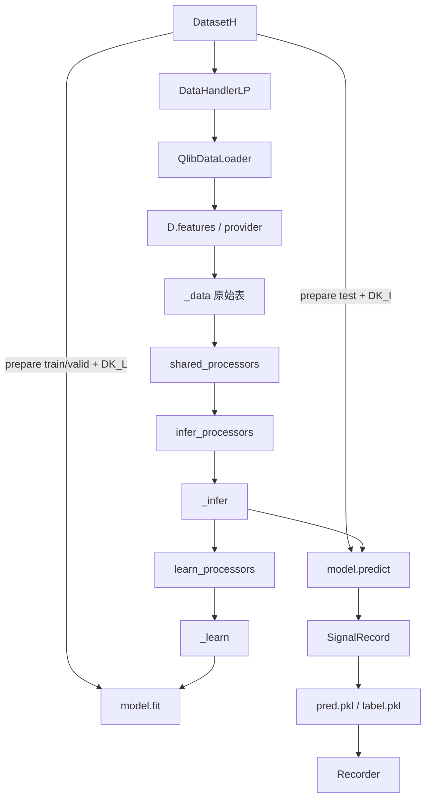
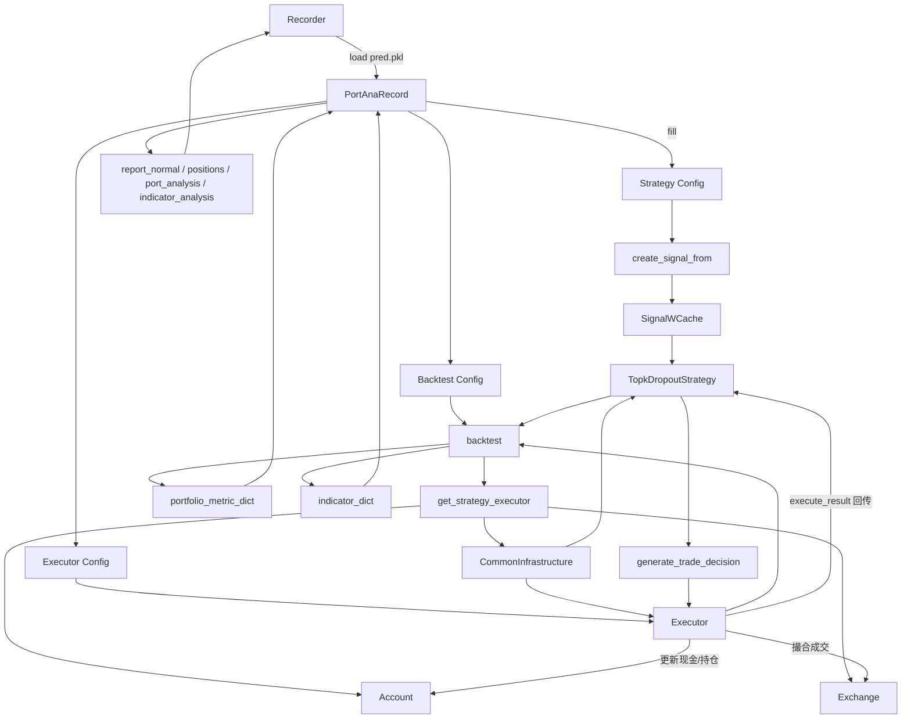
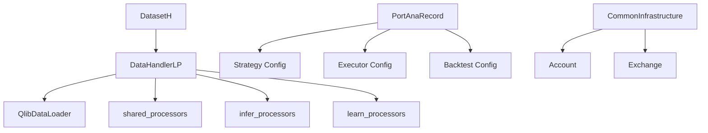
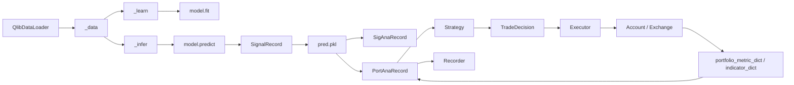

# `qrun benchmarks/LightGBM/workflow_config_lightgbm_Alpha158.yaml` 源码导读

这份文档不再只讲“数据流概念”，而是把这条工作流对应到源码里的类、继承关系、关键方法，以及如果你不用默认实现时，应该在哪一层替换。

默认执行方式：

```bash
cd examples
qrun benchmarks/LightGBM/workflow_config_lightgbm_Alpha158.yaml
```

配置文件路径：
`examples/benchmarks/LightGBM/workflow_config_lightgbm_Alpha158.yaml`

---

## 一、先看全局

先把整条链压成一句话：

```text
YAML
-> qlib.cli.run.workflow
-> qlib.init(provider_uri=~/.qlib/qlib_data/cn_data)
-> task_train
-> init_instance_by_config(model/dataset)
-> Alpha158(DataHandlerLP)
-> QlibDataLoader
-> D.instruments + D.features
-> DataHandlerLP.process_data
-> DatasetH.prepare
-> LGBModel.fit / predict
-> SignalRecord
-> SigAnaRecord
-> PortAnaRecord
-> mlruns
```

如果换成“数据形态”的视角：

```text
cn_data 里的基础行情二进制文件
-> 表达式展开后的 raw DataFrame
-> 处理后的 infer / learn DataFrame
-> train / valid / test 切片
-> LightGBM 的 x/y
-> 预测分数 pred.pkl
-> IC / RankIC / 回测报表
```

这条链最核心的分层是：

- 入口层：`qrun`、`workflow`、`task_train`
- 数据层：`QlibDataLoader`、`Alpha158`、`DataHandlerLP`、`DatasetH`
- 模型层：`LGBModel`
- 分析层：`SignalRecord`、`SigAnaRecord`、`PortAnaRecord`

为了让“默认实现”和“自定义实现”能串起来，后面我用一条贯穿示例说明整条链怎么替换。假设你要把默认链：

```text
Alpha158 + LGBModel + SignalRecord + TopkDropoutStrategy
```

换成：

```text
MyLoader + MyHandler + MyModel + MyScoreRecord + MyStrategy
```

后面每一层都用这一套名字继续往下接。

为了让整篇样例能追踪下去，后面默认都尽量使用同一套示例口径：

- 固定股票：`SH600000`、`SH600519`、`SZ000001`
- 训练段锚点样例：`2008-01-02`
- 验证段锚点样例：`2015-01-05`
- 测试段主样例：`2017-01-03`、`2017-01-04`
- 如果某一步必须展示序列行为，例如 IC 时间序列，才额外带上 `2017-01-05`

这样你可以把后面的样例当成“同一批股票在同一条工作流里逐层流转”的连续快照。

---

### 1.1 架构图：按数据流转来画

下面这几张图直接按源码里的实际调用关系来画，重点看三件事：

- 谁包含谁
- 谁产出结果给谁
- 哪些结果会落到 `Recorder` 里再被下游复用

#### 总体数据流

```mermaid
flowchart LR
    A[workflow.yaml / qrun] --> B[qlib.cli.run.workflow]
    B --> C[task_train]
    C --> D[init_instance_by_config]
    D --> M[Model]
    D --> DS[DatasetH]

    DS --> H[DataHandlerLP]
    H --> L[QlibDataLoader]
    L --> Q[D.features / provider data]

    H --> R0[_data 原始数据]
    R0 --> P1[shared_processors]
    P1 --> I[_infer 推理视图]
    I -->|append模式| P2[learn_processors]
    P1 -->|independent模式| P2
    P2 --> L1[_learn 训练视图]

    DS -->|prepare train/valid + DK_L| MF[model.fit]
    L1 --> MF

    DS -->|prepare test + DK_I| MP[model.predict]
    I --> MP

    MF --> REC[Recorder]
    MP --> SR[SignalRecord]
    SR -->|pred.pkl / label.pkl| REC

    REC --> SAR[SigAnaRecord]
    SAR -->|IC / RankIC / long-short分析| REC

    REC --> PAR[PortAnaRecord]
    PAR -->|读取 pred.pkl 并填充 <PRED>| ST[Strategy]
    PAR --> EX[Executor]
    PAR --> BT[Backtest Config]

    ST --> SIG[Signal]
    EX --> BK[backtest]
    BT --> BK
    SIG --> BK

    BK --> PM[portfolio_metric_dict]
    BK --> IM[indicator_dict]

    PM --> PAR
    IM --> PAR
    PAR -->|report / positions / risk / indicator_analysis| REC
```



#### 训练与预测层



#### 回测执行层



#### 谁包含谁



#### 谁的结果给谁



可以把这几张图和后面正文一一对上：

- 入口层对应 `workflow -> task_train -> init_instance_by_config`
- 数据层对应 `QlibDataLoader -> DataHandlerLP -> DatasetH`
- 模型层对应 `fit/predict`
- 记录与分析层对应 `SignalRecord -> SigAnaRecord -> PortAnaRecord -> Recorder`

## 二、入口层：YAML 是怎么变成对象的

默认配置的核心部分是：

```yaml
qlib_init:
    provider_uri: "~/.qlib/qlib_data/cn_data"
    region: cn

task:
    model:
        class: LGBModel
        module_path: qlib.contrib.model.gbdt
    dataset:
        class: DatasetH
        module_path: qlib.data.dataset
        kwargs:
            handler:
                class: Alpha158
                module_path: qlib.contrib.data.handler
                kwargs:
                    start_time: 2008-01-01
                    end_time: 2020-08-01
                    fit_start_time: 2008-01-01
                    fit_end_time: 2014-12-31
                    instruments: csi300
            segments:
                train: [2008-01-01, 2014-12-31]
                valid: [2015-01-01, 2016-12-31]
                test: [2017-01-01, 2020-08-01]
```

入口代码在 [run.py](/abs/path/E:/code/qlib/qlib/cli/run.py:87) 的 `workflow`。

主流程只有几步：

1. `render_template(config_path)`
2. `yaml.load(rendered_yaml)`
3. `qlib.init(**config["qlib_init"])`
4. `task_train(config["task"], experiment_name=...)`
5. `recorder.save_objects(config=config)`

真正把 YAML 里的 `class/module_path/kwargs` 变成实例的，是 [init_instance_by_config](/abs/path/E:/code/qlib/qlib/utils/mod.py:122)。

这意味着自定义接入时，你不用改训练主流程，只要：

- Python 能 import 到你的类
- YAML 指向你的类

例如，上面的贯穿示例如果换成自己的实现，可以直接写成：

```yaml
sys:
    rel_path:
        - ..

task:
    model:
        class: MyModel
        module_path: my_ext.model
        kwargs:
            hidden_size: 128
    dataset:
        class: DatasetH
        module_path: qlib.data.dataset
        kwargs:
            handler:
                class: MyHandler
                module_path: my_ext.handler
                kwargs:
                    start_time: 2008-01-01
                    end_time: 2020-08-01
                    fit_start_time: 2008-01-01
                    fit_end_time: 2014-12-31
                    instruments: csi300
            segments:
                train: [2008-01-01, 2014-12-31]
                valid: [2015-01-01, 2016-12-31]
                test: [2017-01-01, 2020-08-01]
    record:
        - class: SignalRecord
          module_path: qlib.workflow.record_temp
          kwargs:
            model: <MODEL>
            dataset: <DATASET>
        - class: MyScoreRecord
          module_path: my_ext.record
```

`qrun` 会照样跑，因为它根本不关心你是不是默认类，它只负责按配置实例化。

这一层处理的输入和输出其实都很简单。

- 输入格式：YAML 文本
- 输出格式：Python `dict`，其中 `task.model`、`task.dataset`、`task.record` 还是“配置对象”，还不是实例

最小样例：

```yaml
task:
  model:
    class: MyModel
    module_path: my_ext.model
  dataset:
    class: DatasetH
    module_path: qlib.data.dataset
```

会先变成概念上这样的 Python 对象：

```python
{
    "task": {
        "model": {"class": "MyModel", "module_path": "my_ext.model"},
        "dataset": {"class": "DatasetH", "module_path": "qlib.data.dataset"},
    }
}
```

如果把同一份配置再往前推一步，实例化之后你可以把它理解成：

```text
config["task"]["dataset"] -> DatasetH(...)
config["task"]["dataset"]["kwargs"]["handler"] -> Alpha158(...) 或 MyHandler(...)
config["task"]["model"] -> LGBModel(...) 或 MyModel(...)
```

---

## 三、数据层：`cn_data -> loader -> handler -> dataset`

### 3.1 `qlib_init` 和 `cn_data`

`qlib_init` 里的：

```yaml
provider_uri: "~/.qlib/qlib_data/cn_data"
```

决定了底层数据仓库位置。

底层 provider 入口在 [data.py](/abs/path/E:/code/qlib/qlib/data/data.py:1151)。你可以把 `cn_data` 理解成一个本地数据仓库，通常有：

- `calendars/`
- `instruments/`
- `features/<instrument>/<field>.day.bin`

更底层的文件读取可以看 [FileFeatureStorage](/abs/path/E:/code/qlib/qlib/data/storage/file_storage.py:285)。

这一步最容易混淆的点是：

- `cn_data` 里通常存的是 `$open/$high/$low/$close/$vwap/$volume`
- 不直接存 `Alpha158` 特征列
- 也不直接存 `LABEL0`

后两者都是上层运行时现算出来的。

这一层可以先把输入输出理解成“文件仓库”而不是 DataFrame。

- 输入格式：`provider_uri` 指向的数据目录
- 输出格式：供 `D.instruments(...)`、`D.features(...)` 查询的底层数据源

最小样例：

```text
~/.qlib/qlib_data/cn_data/
├── calendars/day.txt
├── instruments/csi300.txt
└── features/sh600000/close.day.bin
```

所以这一步还没有真正出现训练样本表，只是把“原料仓库”挂到 Qlib 运行时。

如果把“原料”讲得更具体一点，可以把它理解成下面这种一维时间序列文件集合：

```text
instrument = SH600000

close.day.bin   -> [12.31, 12.45, 12.38, 12.56, ...]
open.day.bin    -> [12.20, 12.41, 12.50, 12.40, ...]
volume.day.bin  -> [1.2e7, 1.8e7, 1.5e7, 2.1e7, ...]
```

上层不会直接拿这个 bin 文件训练，而是先被表达式系统转成二维样本表。

### 3.2 `QlibDataLoader`：第一层真正碰 `cn_data` 的类

`QlibDataLoader` 定义在 [loader.py](/abs/path/E:/code/qlib/qlib/data/dataset/loader.py:153)。

继承关系是：

```text
DataLoader
-> DLWParser
-> QlibDataLoader
```

关键方法是 `load_group_df(...)`，里面最重要的一句是：

```python
df = D.features(instruments, exprs, start_time, end_time, freq=freq, inst_processors=inst_processors)
```

它的作用是：

- 先用 `D.instruments(...)` 解析股票池
- 再用 `D.features(...)` 按表达式批量取数
- 再把列名整理成你定义的名字

所以默认链里真正的取数关系是：

```text
Alpha158 提供表达式
-> QlibDataLoader 发起查询
-> D.features 从 cn_data 取基础字段并计算表达式
```

如果你不想用默认的 `QlibDataLoader`，先判断你是哪种情况。

第一种，你还是从 Qlib 数据仓库取数，只是想换列组织方式、拼多频、改列名。

这时最省事的是继承 `QlibDataLoader`，仓库里现成例子是 [Avg15minLoader](/abs/path/E:/code/qlib/examples/benchmarks/LightGBM/multi_freq_handler.py:8)：

```python
class Avg15minLoader(QlibDataLoader):
    def load(self, instruments=None, start_time=None, end_time=None):
        df = super().load(instruments, start_time, end_time)
        if self.is_group:
            df.columns = df.columns.map(...)
        return df
```

第二种，你连底层来源都要换，比如要从 parquet、pickle、外部接口或多个已有 handler 拼起来。

这时就应该直接继承 `DataLoader`，最小接口只有一个：

```python
class MyLoader(DataLoader):
    def load(self, instruments, start_time=None, end_time=None):
        ...
        return df
```

贯穿示例里可以这样写：

```python
from qlib.data.dataset.loader import DataLoader

class MyLoader(DataLoader):
    def __init__(self, feature_path):
        self.feature_path = feature_path

    def load(self, instruments, start_time=None, end_time=None):
        # 这里可以换成 parquet / csv / API / 多源拼接
        df = ...
        return df
```

如果你的需求是“把几个已有 handler 的结果横向拼起来”，优先看 [DataLoaderDH](/abs/path/E:/code/qlib/qlib/data/dataset/loader.py:354)，不一定要自己重写一层。

这一层开始，输入输出已经变成了表。

- 输入格式：
  - `instruments`：如 `csi300` 或具体股票列表
  - `start_time/end_time`
  - 表达式列表 `exprs`
  - 列名列表 `names`
- 输出格式：
  - `pandas.DataFrame`
  - index：`MultiIndex(datetime, instrument)`
  - columns：通常是双层列，第一层是 `feature/label`

默认链一个最小取数样例可以理解成：

输入：

```python
exprs = ["$close/$close", "Ref($close, -2)/Ref($close, -1)-1"]
names = ["CLOSE0", "LABEL0"]
```

输出：

```text
datetime    instrument   feature.CLOSE0   label.LABEL0
2017-01-03  SH600000     1.0000           0.0123
2017-01-03  SZ000001     1.0000          -0.0045
2017-01-04  SH600000     1.0000           0.0031
```

如果用一个更接近 `Alpha158` 的默认输出样例，可以理解成：

```text
datetime    instrument   feature.OPEN0   feature.HIGH0   feature.LOW0   feature.VWAP0   feature.MA5   feature.STD20   label.LABEL0
2017-01-03  SH600000     0.9983          1.0124          0.9921         1.0017          0.9875        0.0213          0.0123
2017-01-03  SZ000001     1.0041          1.0152          0.9958         1.0066          1.0024        0.0187         -0.0045
2017-01-04  SH600000     1.0012          1.0081          0.9964         1.0009          0.9928        0.0220          0.0031
2017-01-04  SZ000001     0.9974          1.0068          0.9910         0.9982          1.0048        0.0179          0.0062
```

这里可以看出几件事：

- 一行就是一个 `(datetime, instrument)` 样本
- 同一行里既有 `feature.*`，也有 `label.*`
- 这时还只是 loader 输出，不代表已经可以直接给模型训练

贯穿示例里的 `MyLoader` 也最好保持同样的输出约定，否则后面的 `DataHandlerLP` 和 `DatasetH` 很难直接复用。

为了方便你把后面的表一路对上，这里先固定一份“测试段原始取数快照”作为母表：

```text
datetime    instrument   feature.OPEN0   feature.HIGH0   feature.LOW0   feature.VWAP0   feature.MA5   feature.STD20   label.LABEL0
2017-01-03  SH600519     1.0031          1.0182          0.9970         1.0061          1.0044        0.0168         -0.0017
2017-01-03  SH600000     0.9983          1.0124          0.9921         1.0017          0.9875        0.0213          0.0123
2017-01-03  SZ000001     1.0041          1.0152          0.9958         1.0066          1.0024        0.0187         -0.0045
2017-01-04  SH600519     0.9992          1.0078          0.9945         1.0010          1.0063        0.0171          0.0048
2017-01-04  SH600000     1.0012          1.0081          0.9964         1.0009          0.9928        0.0220          0.0031
2017-01-04  SZ000001     0.9974          1.0068          0.9910         0.9982          1.0048        0.0179          0.0062
```

后面如果没有特别说明，测试段的很多样例都默认是从这张表继续加工出来的。

### 3.3 `Alpha158` / `DataHandlerLP`：样本表是怎么形成的

`Alpha158` 在 [handler.py](/abs/path/E:/code/qlib/qlib/contrib/data/handler.py:98)，它直接继承 `DataHandlerLP`：

```python
class Alpha158(DataHandlerLP):
```

它在 `__init__` 里做三件事：

1. 准备 processor
2. 构造 `data_loader`
3. 调父类 `DataHandlerLP.__init__`

本质上，`Alpha158` 不是“因子清单”，而是一个完整的 handler，负责：

- 定义 feature 表达式
- 定义 label 表达式
- 接入 loader
- 产出 `raw / infer / learn` 三种数据视图

`LABEL0` 的默认定义在 [get_label_config](/abs/path/E:/code/qlib/qlib/contrib/data/handler.py:151)：

```python
Ref($close, -2) / Ref($close, -1) - 1
```

也就是：

```text
T 这天的标签 = T+1 收盘到 T+2 收盘的收益率
```

如果你只是想换特征表达式、标签表达式、或者把一个新 loader 接进来，通常不该改 `DatasetH`，而是新写一个 `DataHandlerLP` 子类。

贯穿示例里，`MyHandler` 可以这样接上前面的 `MyLoader`：

```python
from qlib.data.dataset.handler import DataHandlerLP

class MyHandler(DataHandlerLP):
    def __init__(
        self,
        instruments=None,
        start_time=None,
        end_time=None,
        infer_processors=[],
        learn_processors=[],
        **kwargs,
    ):
        data_loader = {
            "class": "MyLoader",
            "module_path": "my_ext.loader",
            "kwargs": {
                "feature_path": kwargs["feature_path"],
            },
        }
        super().__init__(
            instruments=instruments,
            start_time=start_time,
            end_time=end_time,
            data_loader=data_loader,
            infer_processors=infer_processors,
            learn_processors=learn_processors,
        )
```

如果你在 `MyHandler` 里开始大量手写标准化、删样本、填空值逻辑，先停一下，因为那部分往往应该放到 `Processor`。

这一层的输入输出是：

- 输入格式：来自 `DataLoader` 的原始表
- 输出格式：依然是 `DataFrame`，但已经被组织成当前任务真正要用的样本表

默认 `Alpha158` handler 产出的 `raw` 表可以把它想成：

```text
index: MultiIndex(datetime, instrument)
columns:
  feature.OPEN0
  feature.HIGH0
  feature.LOW0
  feature.VWAP0
  feature.MA5
  ...
  label.LABEL0
```

一个最小结构样例如下：

```text
datetime    instrument   feature.OPEN0   feature.MA5   label.LABEL0
2017-01-03  SH600000     1.0021          0.9987        0.0123
2017-01-03  SZ000001     0.9975          1.0042       -0.0045
2017-01-04  SH600000     1.0013          1.0008        0.0031
```

更完整一点，可以把 handler 接手后的 `raw` 样本表理解成：

```text
index = MultiIndex(["datetime", "instrument"])
columns =
  feature.OPEN0
  feature.HIGH0
  feature.LOW0
  feature.VWAP0
  feature.MA5
  feature.MA10
  feature.STD20
  feature.RSI-like
  label.LABEL0
```

对应的局部表：

```text
datetime    instrument   feature.OPEN0   feature.HIGH0   feature.LOW0   feature.MA5   feature.MA10   feature.STD20   label.LABEL0
2017-01-03  SH600000     0.9983          1.0124          0.9921         0.9875        0.9812         0.0213          0.0123
2017-01-03  SH600519     1.0031          1.0182          0.9970         1.0044        0.9991         0.0168         -0.0017
2017-01-03  SZ000001     1.0041          1.0152          0.9958         1.0024        1.0011         0.0187         -0.0045
2017-01-04  SH600000     1.0012          1.0081          0.9964         0.9928        0.9837         0.0220          0.0031
2017-01-04  SH600519     0.9992          1.0078          0.9945         1.0063        1.0006         0.0171          0.0048
2017-01-04  SZ000001     0.9974          1.0068          0.9910         1.0048        1.0027         0.0179          0.0062
```

贯穿示例里的 `MyHandler`，只要最终也能产出这种“样本表”，上层 `DatasetH` 和 `Model` 就可以继续复用。

把默认 `Alpha158` 的 raw 表再写成“连续两天三只股票”的版本，就是：

```text
datetime    instrument   feature.OPEN0   feature.HIGH0   feature.LOW0   feature.VWAP0   feature.MA5   feature.STD20   label.LABEL0
2017-01-03  SH600519     1.0031          1.0182          0.9970         1.0061          1.0044        0.0168         -0.0017
2017-01-03  SH600000     0.9983          1.0124          0.9921         1.0017          0.9875        0.0213          0.0123
2017-01-03  SZ000001     1.0041          1.0152          0.9958         1.0066          1.0024        0.0187         -0.0045
2017-01-04  SH600519     0.9992          1.0078          0.9945         1.0010          1.0063        0.0171          0.0048
2017-01-04  SH600000     1.0012          1.0081          0.9964         1.0009          0.9928        0.0220          0.0031
2017-01-04  SZ000001     0.9974          1.0068          0.9910         0.9982          1.0048        0.0179          0.0062
```

如果你自定义 `MyHandler`，最稳妥的目标也是先产出一张结构类似的表，再考虑更复杂的模型输入。

### 3.4 `Processor`：只改处理逻辑时不要直接重写 Handler

基类在 [processor.py](/abs/path/E:/code/qlib/qlib/data/dataset/processor.py:35)：

```python
class Processor(Serializable):
    def fit(self, df=None):
        ...
    def __call__(self, df):
        ...
```

如果你的需求只是：

- 删除某些样本
- 对特征标准化
- 填缺失值
- 做截面归一化

优先写 `Processor`，不要先重写 `DataHandlerLP`。

例如最小自定义处理器可以是：

```python
from qlib.data.dataset.processor import Processor

class MyClipProcessor(Processor):
    def __init__(self, lower=-3, upper=3):
        self.lower = lower
        self.upper = upper

    def __call__(self, df):
        df["feature"] = df["feature"].clip(self.lower, self.upper)
        return df
```

然后在 `MyHandler` 的 `infer_processors` 或 `learn_processors` 里接进去。

这就是更合理的分工：

```text
Loader 决定“数据从哪来”
Handler 决定“样本表长什么样”
Processor 决定“样本表怎么后处理”
```

这一层的输入输出格式不会变，变化的是“值”和“样本是否被保留”。

- 输入格式：`DataFrame`
- 输出格式：`DataFrame`

例如 `MyClipProcessor` 的处理前后可以理解成：

处理前：

```text
datetime    instrument   feature.MA5
2017-01-03  SH600000     12.4
2017-01-03  SZ000001     -8.7
```

处理后：

```text
datetime    instrument   feature.MA5
2017-01-03  SH600000      3.0
2017-01-03  SZ000001     -3.0
```

所以 Processor 解决的是“同一张表怎么变”，而不是“表从哪来”。

如果给一个更完整的“多列处理前后”样例，会更贴近真实情况。

处理前：

```text
datetime    instrument   feature.MA5   feature.STD20   label.LABEL0
2017-01-03  SH600000     NaN           inf             0.0123
2017-01-03  SH600519     5.8           0.018          NaN
2017-01-03  SZ000001    -8.7           0.021         -0.0045
```

经过 `ProcessInf + Fillna + MyClipProcessor + DropnaLabel` 之后可能变成：

```text
datetime    instrument   feature.MA5   feature.STD20   label.LABEL0
2017-01-03  SH600000     0.0           0.000          0.0123
2017-01-03  SZ000001    -3.0           0.021         -0.0045
```

如果继续沿用三只股票的连续样例，更完整的处理前后可以写成：

处理前：

```text
datetime    instrument   feature.MA5   feature.STD20   label.LABEL0
2017-01-03  SH600519     5.8           0.018          NaN
2017-01-03  SH600000     NaN           inf             0.0123
2017-01-03  SZ000001    -8.7           0.021         -0.0045
2017-01-04  SH600519     4.2           0.017          0.0048
2017-01-04  SH600000    -6.2           0.019          0.0031
2017-01-04  SZ000001     1.4           NaN            0.0062
```

处理后：

```text
datetime    instrument   feature.MA5   feature.STD20   label.LABEL0
2017-01-03  SH600000     0.0           0.000          0.0123
2017-01-03  SZ000001    -3.0           0.021         -0.0045
2017-01-04  SH600519     3.0           0.017          0.0048
2017-01-04  SH600000    -3.0           0.019          0.0031
2017-01-04  SZ000001     1.4           0.000          0.0062
```

这里你能同时看到：

- `SH600519` 在 `2017-01-03` 因为 `label` 为空被训练链删掉
- `SH600000` 的 `NaN/inf` 被清洗
- 极端值被裁剪
- `2017-01-04` 的样本继续保留到了后续阶段

也就是：

- `inf` 被处理掉
- `NaN` 被填成 0
- 极端值被截断
- label 为空的样本被删除

### 3.5 `DataHandlerLP`：为什么会有 `raw / infer / learn`

`DataHandlerLP` 在 [handler.py](/abs/path/E:/code/qlib/qlib/data/dataset/handler.py:383)。

它维护三份数据：

- `self._data` / `DK_R`
- `self._infer` / `DK_I`
- `self._learn` / `DK_L`

核心方法是 [process_data](/abs/path/E:/code/qlib/qlib/data/dataset/handler.py:553)。

这层的意义是：

- 训练链允许使用依赖标签的处理器
- 预测链必须避免这类处理器

这也是为什么模型训练通常读 `DK_L`，预测通常读 `DK_I`。

这一步最适合直接看三份数据长什么样。

- `DK_R` / `raw`
  - 输入：Loader 刚返回的样本表
  - 输出：未经过训练/预测链分流的原始任务表
- `DK_I` / `infer`
  - 输入：`raw` 加上可用于推理的 processors
  - 输出：预测时读取的表
- `DK_L` / `learn`
  - 输入：`raw` 或 `infer` 再经过训练专用 processors
  - 输出：训练时读取的表

一个最小样例：

`raw`

```text
datetime    instrument   feature.MA5   label.LABEL0
2017-01-03  SH600000     NaN           0.0123
2017-01-03  SZ000001     8.6          -0.0045
```

`infer`

```text
datetime    instrument   feature.MA5   label.LABEL0
2017-01-03  SH600000     0.0           0.0123
2017-01-03  SZ000001     3.0          -0.0045
```

`learn`

```text
datetime    instrument   feature.MA5   label.LABEL0
2017-01-03  SH600000     0.0           0.85
2017-01-03  SZ000001     3.0          -0.85
```

如果用一组更完整、能看出分流差异的样例：

`raw`

```text
datetime    instrument   feature.MA5   feature.STD20   label.LABEL0
2017-01-03  SH600000     NaN           inf             0.0123
2017-01-03  SH600519     5.8           0.018          NaN
2017-01-03  SZ000001     8.6           0.021         -0.0045
2017-01-04  SH600000    -6.2           0.019          0.0031
```

`infer`

```text
datetime    instrument   feature.MA5   feature.STD20   label.LABEL0
2017-01-03  SH600000     0.0           0.000          0.0123
2017-01-03  SH600519     3.0           0.018          NaN
2017-01-03  SZ000001     3.0           0.021         -0.0045
2017-01-04  SH600000    -3.0           0.019          0.0031
```

`learn`

```text
datetime    instrument   feature.MA5   feature.STD20   label.LABEL0
2017-01-03  SH600000     0.0           0.000           0.85
2017-01-03  SZ000001     3.0           0.021          -0.85
2017-01-04  SH600000    -3.0           0.019           0.10
```

这里能直接看出：

- `infer` 保留了 `label` 为空的 `SH600519` 样本，因为预测时可能仍需要它的 feature
- `learn` 删掉了 `label` 为空的样本
- `learn` 里的 label 还可能继续被标准化

如果把两天都串起来，三份数据的连续关系可以总结成：

```text
raw   : 最完整，但可能有 NaN / inf / 空 label
infer : 适合预测，尽量保留样本，只做预测期也能复用的清洗
learn : 适合训练，只保留可监督样本，并允许继续做 label 相关处理
```

这里的例子只是为了说明：

- `infer` 往往做的是可在线复用的清洗
- `learn` 可能还会继续做标签相关处理

### 3.6 `DatasetH`：大多数 tabular 任务不必改它

`DatasetH` 在 [__init__.py](/abs/path/E:/code/qlib/qlib/data/dataset/__init__.py:72)。

它的职责很简单：

- 持有 `handler`
- 保存 `segments`
- 在 `prepare(...)` 里把 `"train"/"valid"/"test"` 映射成切片
- 再调用 `handler.fetch(...)`

所以 `DatasetH` 不是数据生产者，真正生产数据的是 handler。

这也意味着：

- 大多数表格型任务不需要自定义 `Dataset`
- 只要你的输入还是“按日期切片的样本表”，继续用 `DatasetH` 就够了

只有在这些场景下才更像该改 `Dataset`：

- 模型要时间窗采样而不是单行样本
- `prepare()` 要返回 DataLoader、Sampler 或张量对象
- 切片规则不是简单的时间段

`DatasetH.prepare(...)` 的输入输出可以直接用默认训练链来看。

- 输入格式：
  - `segments="train"` 或 `"valid"` 或 `"test"`
  - `col_set="feature"` 或 `["feature", "label"]`
  - `data_key=DK_L` 或 `DK_I`
- 输出格式：
  - `DataFrame`
  - 已经按你请求的 segment 和列集合裁好

最小样例：

```python
dataset.prepare("train", col_set=["feature", "label"], data_key=DataHandlerLP.DK_L)
```

输出概念上是：

```text
datetime    instrument   feature.OPEN0   feature.MA5   label.LABEL0
2008-01-02  SH600000     1.0021          0.9987        0.0123
2008-01-02  SZ000001     0.9975          1.0042       -0.0045
...
2014-12-31  SH600000     1.0012          1.0034        0.0061
```

而：

```python
dataset.prepare("test", col_set="feature", data_key=DataHandlerLP.DK_I)
```

输出则没有 label：

```text
datetime    instrument   feature.OPEN0   feature.MA5
2017-01-03  SH600000     1.0021          0.9987
2017-01-03  SZ000001     0.9975          1.0042
```

如果把 `segments` 的边界也带进去看，会更直观：

```yaml
segments:
  train: [2008-01-01, 2014-12-31]
  valid: [2015-01-01, 2016-12-31]
  test:  [2017-01-01, 2020-08-01]
```

那么：

- `dataset.prepare("train", ...)` 只会返回 `2008-01-01 ~ 2014-12-31`
- `dataset.prepare("valid", ...)` 只会返回 `2015-01-01 ~ 2016-12-31`
- `dataset.prepare("test", ...)` 只会返回 `2017-01-01 ~ 2020-08-01`

可以把三个分段想成三张结构一致、时间范围不同的表：

`train`

```text
datetime    instrument   feature.OPEN0   feature.MA5   label.LABEL0
2008-01-02  SH600000     1.0021          0.9987        0.0123
2008-01-02  SH600519     1.0011          1.0032       -0.0015
```

`valid`

```text
datetime    instrument   feature.OPEN0   feature.MA5   label.LABEL0
2015-01-05  SH600000     0.9984          1.0002        0.0041
2015-01-05  SH600519     1.0035          1.0061       -0.0022
```

`test`

```text
datetime    instrument   feature.OPEN0   feature.MA5
2017-01-03  SH600000     1.0021          0.9987
2017-01-03  SH600519     1.0048          1.0023
```

如果把三只股票都补齐，更接近真实的 segment 切片结果会是：

`train`

```text
datetime    instrument   feature.OPEN0   feature.MA5   label.LABEL0
2008-01-02  SH600519     1.0011          1.0032       -0.0015
2008-01-02  SH600000     1.0021          0.9987        0.0123
2008-01-02  SZ000001     0.9975          1.0042       -0.0045
```

`valid`

```text
datetime    instrument   feature.OPEN0   feature.MA5   label.LABEL0
2015-01-05  SH600519     1.0035          1.0061       -0.0022
2015-01-05  SH600000     0.9984          1.0002        0.0041
2015-01-05  SZ000001     1.0007          0.9969        0.0018
```

`test`

```text
datetime    instrument   feature.OPEN0   feature.MA5
2017-01-03  SH600519     1.0031          1.0044
2017-01-03  SH600000     0.9983          0.9875
2017-01-03  SZ000001     1.0041          1.0024
2017-01-04  SH600519     0.9992          1.0063
2017-01-04  SH600000     1.0012          0.9928
2017-01-04  SZ000001     0.9974          1.0048
```

---

## 四、模型与分析层：`dataset -> model -> record`

### 4.1 `LGBModel.fit`：训练时到底取了什么

`LGBModel` 在 [gbdt.py](/abs/path/E:/code/qlib/qlib/contrib/model/gbdt.py:16)。

最关键的是 `_prepare_data(...)`：

```python
df = dataset.prepare(key, col_set=["feature", "label"], data_key=DataHandlerLP.DK_L)
```

这说明默认训练时取的是：

- `train/valid`
- `feature + label`
- `learn` 视图

随后 `fit()` 里把它们转成 LightGBM 的 `lgb.Dataset`，再训练并写指标。

这一层最重要的是把“Dataset 输出的 DataFrame”变成“模型真正训练的数据”。

- 输入格式：
  - `DataFrame`
  - `feature` 子表：二维特征矩阵
  - `label` 子表：一列监督值
- 输出格式：
  - 训练阶段：模型内部对象，比如 `lgb.Dataset`、树模型、神经网络权重
  - 预测阶段：`pd.Series` 或单列 `DataFrame`

默认 `LGBModel.fit` 里，`df["feature"]` 和 `df["label"]` 的最小结构可以理解成：

`x`

```text
datetime    instrument   OPEN0    MA5
2008-01-02  SH600000     1.0021   0.9987
2008-01-02  SZ000001     0.9975   1.0042
```

`y`

```text
datetime    instrument   LABEL0
2008-01-02  SH600000     0.0123
2008-01-02  SZ000001    -0.0045
```

然后再变成概念上的：

```text
X.shape = (N, F)
y.shape = (N,)
```

更完整的训练输入可以一直保留三只股票：

`x`

```text
datetime    instrument   OPEN0    MA5      STD20
2008-01-02  SH600519     1.0011   1.0032   0.0168
2008-01-02  SH600000     1.0021   0.9987   0.0213
2008-01-02  SZ000001     0.9975   1.0042   0.0187
```

`y`

```text
datetime    instrument   LABEL0
2008-01-02  SH600519    -0.0015
2008-01-02  SH600000     0.0123
2008-01-02  SZ000001    -0.0045
```

如果把 `DataFrame -> numpy` 这个转换再写得直一点：

训练前 DataFrame：

```text
datetime    instrument   OPEN0    MA5      STD20    LABEL0
2008-01-02  SH600000     1.0021   0.9987   0.0213   0.0123
2008-01-02  SH600519     1.0011   1.0032   0.0168  -0.0015
2008-01-02  SZ000001     0.9975   1.0042   0.0187  -0.0045
```

转换后：

```text
X =
[[1.0021, 0.9987, 0.0213],
 [1.0011, 1.0032, 0.0168],
 [0.9975, 1.0042, 0.0187]]

y =
[ 0.0123, -0.0015, -0.0045 ]
```

### 4.2 如果你要换训练方法，通常只要继承 `Model`

基类在 [base.py](/abs/path/E:/code/qlib/qlib/model/base.py:22)：

```python
class Model(BaseModel):
    def fit(self, dataset, reweighter):
        ...
    def predict(self, dataset, segment="test"):
        ...
```

最小接口只有两个：

- `fit(dataset, reweighter=None)`
- `predict(dataset, segment="test")`

贯穿示例里的 `MyModel` 可以写成：

```python
import pandas as pd
from qlib.model.base import Model
from qlib.data.dataset.handler import DataHandlerLP

class MyModel(Model):
    def __init__(self, hidden_size=128):
        self.hidden_size = hidden_size
        self.model = None

    def fit(self, dataset, reweighter=None):
        df = dataset.prepare("train", col_set=["feature", "label"], data_key=DataHandlerLP.DK_L)
        x, y = df["feature"], df["label"].iloc[:, 0]
        self.model = ...
        return self

    def predict(self, dataset, segment="test"):
        x = dataset.prepare(segment, col_set="feature", data_key=DataHandlerLP.DK_I)
        pred = self.model.predict(x.values)
        return pd.Series(pred, index=x.index)
```

自定义模型时有三个约定最好保持不变：

- 训练读 `DK_L`
- 预测读 `DK_I`
- 预测返回值保留 `(datetime, instrument)` 索引

因为后面的 `SignalRecord`、`SigAnaRecord`、`PortAnaRecord` 都依赖这个约定。

如果你想看一个非常简单但可工作的例子，可以直接看 [FactorColumnModel](/abs/path/E:/code/qlib/examples/study_yaml_workflow/mylib/model.py:25)。

它证明了一件事：

```text
只要 fit/predict 接口对了，哪怕根本不是“真训练模型”，也能接进整条 qrun 工作流
```

贯穿示例里的 `MyModel.predict(...)` 也最好保持这个输出：

```text
index:  MultiIndex(datetime, instrument)
value:  一个连续分数
```

最小样例：

```text
datetime    instrument   score
2017-01-03  SH600000     0.1832
2017-01-03  SZ000001    -0.0521
2017-01-04  SH600000     0.0917
```

更完整一点的预测表通常像这样：

```text
datetime    instrument   score
2017-01-03  SH600519     0.2210
2017-01-03  SH600000     0.1832
2017-01-03  SZ000001    -0.0521
2017-01-04  SH600519     0.1946
2017-01-04  SH600000     0.0917
2017-01-04  SZ000001     0.0048
```

你后面看到的 TopK、IC、回测，基本都是围绕这张表继续算的。

### 4.3 `SignalRecord`：预测分第一次落盘

`SignalRecord` 在 [record_temp.py](/abs/path/E:/code/qlib/qlib/workflow/record_temp.py:161)。

它做的事情很简单：

1. `model.predict(dataset)`
2. 转成 `pred.pkl`
3. 再取测试段原始标签，保存 `label.pkl`

这里标签优先从 `DK_R` 取，因此 `label.pkl` 更接近“未经训练链处理的原始标签”。

所以这一层落盘后的输入输出很明确：

- 输入格式：
  - `predict()` 返回的 `Series` 或 `DataFrame`
  - 测试段标签表
- 输出格式：
  - `pred.pkl`
  - `label.pkl`

最小样例：

`pred.pkl`

```text
datetime    instrument   score
2017-01-03  SH600000     0.1832
2017-01-03  SZ000001    -0.0521
```

`label.pkl`

```text
datetime    instrument   LABEL0
2017-01-03  SH600000     0.0123
2017-01-03  SZ000001    -0.0045
```

把二者对齐在一起看，会更直观：

```text
datetime    instrument   score     LABEL0
2017-01-03  SH600519     0.2210   -0.0017
2017-01-03  SH600000     0.1832    0.0123
2017-01-03  SZ000001    -0.0521   -0.0045
2017-01-04  SH600519     0.1946    0.0048
2017-01-04  SH600000     0.0917    0.0031
2017-01-04  SZ000001     0.0048    0.0062
```

把这张对齐表按日期拆开，就是后面很多分析真正使用的横截面：

`2017-01-03`

```text
instrument   score     LABEL0
SH600519     0.2210   -0.0017
SH600000     0.1832    0.0123
SZ000001    -0.0521   -0.0045
```

`2017-01-04`

```text
instrument   score     LABEL0
SH600519     0.1946    0.0048
SH600000     0.0917    0.0031
SZ000001     0.0048    0.0062
```

`SigAnaRecord` 和 `PortAnaRecord` 基本都从这种“按日期、按股票对齐的 score/label 或 score/config 关系”继续往下做。

### 4.4 如果你想加新的分析产物，改 `Record`，不要改训练器

如果需求是：

- 训练完之后再算一个新指标
- 输出一个新的 pkl
- 记录一个新的 metrics

最自然的扩展点是 `RecordTemp`。

贯穿示例里的 `MyScoreRecord` 可以这样写：

```python
from qlib.workflow.record_temp import RecordTemp

class MyScoreRecord(RecordTemp):
    def __init__(self, recorder=None, **kwargs):
        super().__init__(recorder=recorder)

    def generate(self, **kwargs):
        pred = self.load("pred.pkl")
        summary = pred.groupby("datetime").mean()
        self.recorder.log_metrics(mean_score=float(summary.mean().iloc[0]))
        self.save(**{"mean_score.pkl": summary})
```

然后在 YAML 的 `task.record` 中接上它即可。

如果你的 record 明确依赖前面某个产物，更适合继承 `ACRecordTemp`。仓库里可参考：

- [MultiSegRecord](/abs/path/E:/code/qlib/qlib/contrib/workflow/record_temp.py:19)
- [SignalMseRecord](/abs/path/E:/code/qlib/qlib/contrib/workflow/record_temp.py:60)

这类扩展都不需要碰 `task_train` 主流程。

贯穿示例里的 `MyScoreRecord`，输入输出也很规整：

- 输入格式：`pred.pkl`
- 输出格式：新的分析结果表或标量

例如它按天算平均分，输出可以是：

```text
datetime    score
2017-01-03  0.0217
2017-01-04  0.0183
```

如果你想做更丰富的 record，完全可以把输出做成更宽的表：

```text
datetime    mean_score   std_score   top1_score   bottom1_score
2017-01-03  0.1174       0.1478      0.2210      -0.0521
2017-01-04  0.0970       0.0949      0.1946       0.0048
```

如果把计算过程写开一点，对应的输入就是：

`2017-01-03`

```text
score = [0.2210, 0.1832, -0.0521]
mean  = 0.1174
top1  = 0.2210
bot1  = -0.0521
```

`2017-01-04`

```text
score = [0.1946, 0.0917, 0.0048]
mean  = 0.0970
top1  = 0.1946
bot1  = 0.0048
```

### 4.5 `SigAnaRecord`：IC / RankIC 是标准“预测后分析”

`SigAnaRecord` 会读取：

- `pred.pkl`
- `label.pkl`

然后调用 `calc_ic(...)` 计算：

- `IC`
- `Rank IC`
- 它们的 IR

因此你也可以把它理解成一个“标准 record 插件”。

如果你要做别的预测后分析，比如：

- MSE
- 分组收益
- 因子覆盖率

本质上都是这一层的事情。

默认 `SigAnaRecord` 的输出样例可以简单理解成：

`ic.pkl`

```text
datetime    ic
2017-01-03  0.041
2017-01-04  0.028
2017-01-05 -0.006
```

`ric.pkl`

```text
datetime    ric
2017-01-03  0.052
2017-01-04  0.031
2017-01-05 -0.010
```

如果把 `pred.pkl` 和 `label.pkl` 中某一天拿出来，IC 的来源就更直观了：

某日横截面：

```text
instrument   score     LABEL0
SH600519     0.2210   -0.0017
SH600000     0.1832    0.0123
SZ000001    -0.0521   -0.0045
```

在这一天上：

- `score` 和 `LABEL0` 做 Pearson 相关 -> 当日 `ic`
- `score` 和 `LABEL0` 的排序做 Spearman 相关 -> 当日 `ric`

把很多天连起来，就形成：

```text
2017-01-03 -> ic = 0.041, ric = 0.052
2017-01-04 -> ic = 0.028, ric = 0.031
2017-01-05 -> ic = -0.006, ric = -0.010
```

如果继续保持同一套股票，你可以把 `2017-01-05` 也脑补成：

```text
instrument   score     LABEL0
SH600519     0.1320   -0.0030
SH600000     0.0870    0.0015
SZ000001     0.0210    0.0048
```

于是就能形成连续三天的 IC/RankIC 时间序列。

---

## 五、回测层：`pred.pkl -> strategy -> executor -> portfolio_analysis`

### 5.1 `PortAnaRecord`：回测是怎么接上 `pred.pkl` 的

`PortAnaRecord` 在 [record_temp.py](/abs/path/E:/code/qlib/qlib/workflow/record_temp.py:361)。

关键逻辑是：

1. `pred = self.load("pred.pkl")`
2. 用 `fill_placeholder(...)` 把配置里的 `<PRED>` 替换成真实预测表
3. 调回测引擎

这正对应 YAML 里的：

```yaml
strategy:
    class: TopkDropoutStrategy
    module_path: qlib.contrib.strategy
    kwargs:
        signal: <PRED>
```

所以 `PortAnaRecord` 的输入已经不再是训练样本，而是“预测信号表”。

- 输入格式：
  - `pred.pkl`
  - `strategy/executor/backtest` 配置
- 输出格式：
  - 回测报表
  - 持仓明细
  - 风险分析表

一个更完整的输出集合通常是：

- `report_normal_day.pkl`
- `positions_normal_day.pkl`
- `port_analysis_day.pkl`
- `indicator_analysis_day.pkl`

### 5.2 `Strategy`：如果你想改“怎么调仓”，改它

默认 daily benchmark 用的是 [TopkDropoutStrategy](/abs/path/E:/code/qlib/qlib/contrib/strategy/signal_strategy.py:75)，它继承自 [BaseSignalStrategy](/abs/path/E:/code/qlib/qlib/contrib/strategy/signal_strategy.py:25)。

如果你的需求是：

- TopK 改成分层持仓
- 增加行业约束
- 做风险预算
- 换买卖规则

那应该改 `Strategy`，不是改 `Model`。

贯穿示例里，`MyStrategy` 最自然的基类就是 `BaseSignalStrategy`。你实现的核心通常是：

- `generate_trade_decision(...)`

也就是把：

```text
signal -> 具体买卖单
```

翻译出来。

这一层可以把输入输出理解成：

- 输入格式：某个交易日的 signal 排序结果 + 当前持仓 + 交易约束
- 输出格式：订单列表或调仓决策对象

最小概念样例：

输入 signal：

```text
datetime    instrument   score
2017-01-03  SH600000     0.1832
2017-01-03  SZ000001    -0.0521
2017-01-03  SH600519     0.2210
```

输出决策：

```text
buy:  SH600519, SH600000
sell: SZ000001
```

真正代码里当然不是这个简化文本，而是订单对象，但语义就是这样。

如果把“当前持仓”也放进来，会更接近真实决策：

当前持仓：

```text
instrument   holding
SH600000     50000
SZ000001     30000
```

当日 signal 排名：

```text
instrument   score
SH600519     0.2210
SH600000     0.1832
SZ000001    -0.0521
```

那么 `TopkDropoutStrategy` 一类策略的直观动作就是：

- 保留高分且已持有的 `SH600000`
- 买入新晋高分的 `SH600519`
- 卖出低分的 `SZ000001`

如果把结果再写成更完整的“调仓后持仓目标”，可以理解成：

```text
before:
SH600000 = 50000
SZ000001 = 30000

after:
SH600519 = 10000
SH600000 = 50000
SZ000001 = 0
```

于是策略层的工作就很清楚了：

- 输入：打分表 + 当前持仓
- 输出：目标持仓或订单

### 5.3 `Executor`：如果你想改“怎么成交”，改它

默认 daily 场景下，`PortAnaRecord` 常走 [SimulatorExecutor](/abs/path/E:/code/qlib/qlib/backtest/executor.py:518)，它继承 [BaseExecutor](/abs/path/E:/code/qlib/qlib/backtest/executor.py:18)。

只有当你要改这些东西时，才更像该改 `Executor`：

- 一个 step 的时间粒度
- 成交撮合规则
- 组合指标生成方式
- 多层执行器结构

贯穿示例里，如果你要换执行器，配置上直接替掉：

```yaml
port_analysis_config: &port_analysis_config
    strategy:
        class: MyStrategy
        module_path: my_ext.strategy
        kwargs:
            signal: <PRED>
    executor:
        class: MyExecutor
        module_path: my_ext.executor
        kwargs:
            time_per_step: day
            generate_portfolio_metrics: true
    backtest:
        start_time: 2017-01-01
        end_time: 2020-08-01
        account: 100000000
        benchmark: SH000300
```

这说明回测链也遵循同一个原则：

```text
默认节点都可以在 YAML 里被替换
```

`Executor` 这一层的输入输出则是：

- 输入格式：策略生成的 trade decision
- 输出格式：成交结果、账户更新、组合指标

最小结果样例可以理解成：

`report_normal_day.pkl`

```text
datetime    return    bench    cost
2017-01-03  0.0012    0.0007   0.0001
2017-01-04 -0.0004   -0.0001   0.0001
```

`positions_normal_day.pkl`

```text
datetime    instrument   amount   price
2017-01-03  SH600519     10000    650.2
2017-01-03  SH600000     50000     12.4
```

再补一张 `port_analysis_day.pkl` 的概念样例，会更完整：

```text
metric_group                  metric               value
excess_return_without_cost    annualized_return    0.128
excess_return_without_cost    information_ratio    0.941
excess_return_without_cost    max_drawdown        -0.083
excess_return_with_cost       annualized_return    0.091
excess_return_with_cost       information_ratio    0.677
excess_return_with_cost       max_drawdown        -0.087
```

如果把这三份回测产物放在一起看，可以把它理解成：

1. `report_normal_day.pkl`
   回答“组合每天赚了多少、基准多少、成本多少”
2. `positions_normal_day.pkl`
   回答“每天具体持了什么、成交了什么”
3. `port_analysis_day.pkl`
   回答“整段回测的年化、IR、回撤等风险收益指标”

---

## 六、把默认链和自定义链重新串一遍

默认 LightGBM Alpha158 链是：

```text
QlibDataLoader
-> Alpha158(DataHandlerLP)
-> DatasetH
-> LGBModel
-> SignalRecord
-> SigAnaRecord
-> PortAnaRecord
-> TopkDropoutStrategy + SimulatorExecutor
```

如果换成文档里的贯穿示例，则会变成：

```text
MyLoader
-> MyHandler(DataHandlerLP)
-> DatasetH
-> MyModel
-> SignalRecord
-> MyScoreRecord
-> PortAnaRecord
-> MyStrategy + MyExecutor
```

注意这里最关键的一点：

```text
不是整条链一起重写，而是按层替换节点
```

所以实践上最稳妥的顺序通常是：

1. 先只换 `Processor`
2. 不够再换 `Handler`
3. 不够再换 `Loader`
4. 模型训练逻辑独立时换 `Model`
5. 预测后分析独立时换 `Record`
6. 调仓逻辑独立时换 `Strategy`
7. 只有撮合/执行规则不满足时才换 `Executor`

这也是为什么 Qlib 的这套工作流适合做“配置驱动的节点替换”。

---

## 七、最后只记住这几个判断就够了

- 想改“数据从哪来”，看 `DataLoader`
- 想改“样本表长什么样”，看 `DataHandlerLP`
- 想改“样本表怎么后处理”，看 `Processor`
- 想改“模型怎么 fit/predict”，看 `Model`
- 想改“训练后多输出什么分析”，看 `RecordTemp`
- 想改“怎么从分数变成调仓”，看 `BaseSignalStrategy`
- 想改“怎么撮合成交”，看 `BaseExecutor`

如果你顺着源码读，推荐顺序仍然是：

1. [workflow_config_lightgbm_Alpha158.yaml](/abs/path/E:/code/qlib/examples/benchmarks/LightGBM/workflow_config_lightgbm_Alpha158.yaml:1)
2. [run.py](/abs/path/E:/code/qlib/qlib/cli/run.py:87)
3. [trainer.py](/abs/path/E:/code/qlib/qlib/model/trainer.py:36)
4. [loader.py](/abs/path/E:/code/qlib/qlib/data/dataset/loader.py:153)
5. [handler.py](/abs/path/E:/code/qlib/qlib/contrib/data/handler.py:98)
6. [processor.py](/abs/path/E:/code/qlib/qlib/data/dataset/processor.py:35)
7. [__init__.py](/abs/path/E:/code/qlib/qlib/data/dataset/__init__.py:72)
8. [gbdt.py](/abs/path/E:/code/qlib/qlib/contrib/model/gbdt.py:16)
9. [record_temp.py](/abs/path/E:/code/qlib/qlib/workflow/record_temp.py:161)
10. [signal_strategy.py](/abs/path/E:/code/qlib/qlib/contrib/strategy/signal_strategy.py:25)
